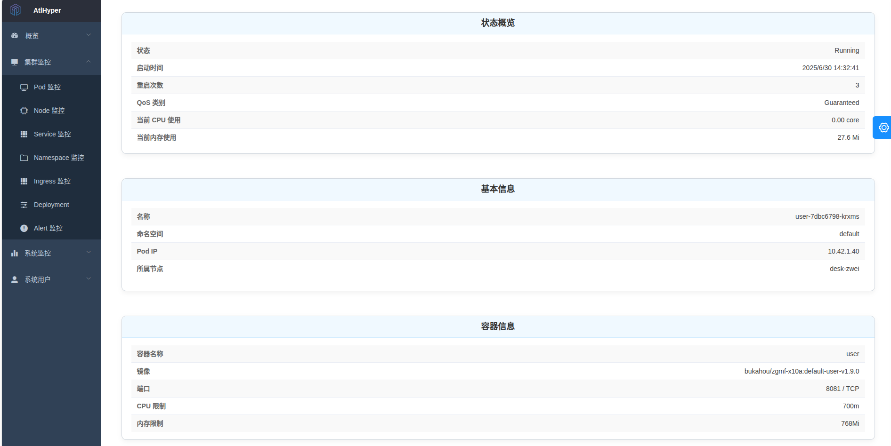
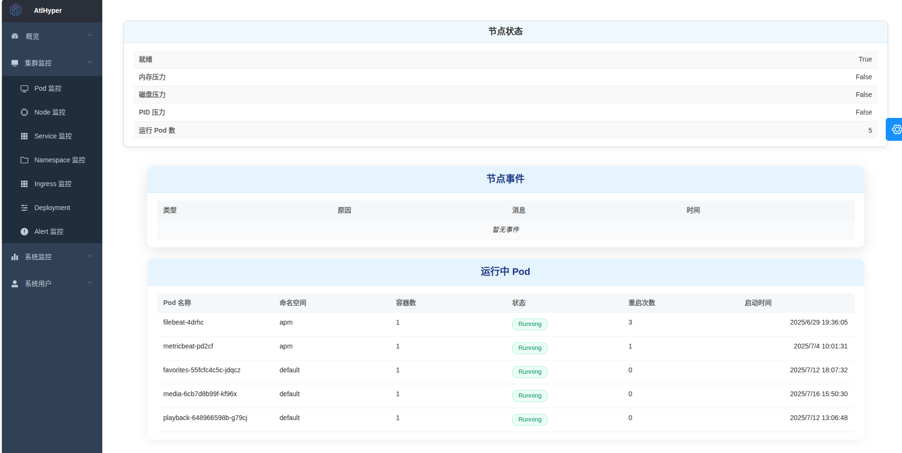
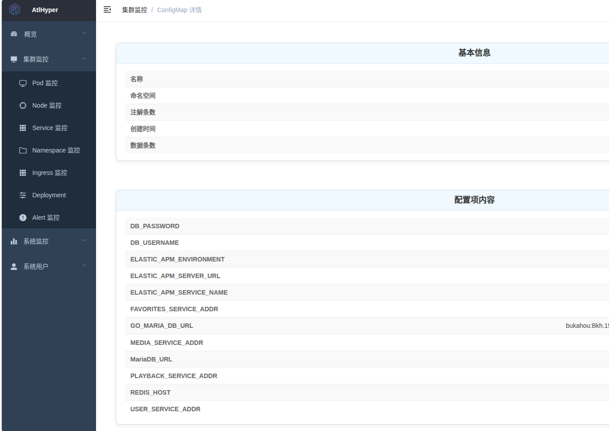

## 🧠 プロジェクト名：AtlHyper

### 📌 プロジェクトの位置付け

**AtlHyper** は、Kubernetes クラスターの軽量な可観測性および制御プラットフォームです。ノード、Pod、Deployment などのコアリソースに対するリアルタイム監視、異常アラート、問題診断、および操作に重点を置いています。フロントエンドとバックエンドを分離したアーキテクチャを採用しており、ローカル開発環境、エッジクラスターの管理、中小規模クラスターに最適です。

本プロジェクトは **MarstAgent モデル** を採用しており、Agent は各 Kubernetes クラスター内に常駐してデータ収集と操作を実行し、コントロールセンター（Marst）は外部の Docker Compose 環境でのデプロイが推奨されます。HTTP 通信を通じて集中管理とマルチクラスター対応を実現します。

---

### 🚀 主な機能

| モジュール       | 機能概要                                                                  |
| ---------------- | ------------------------------------------------------------------------- |
| クラスター概要   | ノード、Pod、Service、Deployment などのリアルタイム統計とリスト表示       |
| アラートシステム | イベントベースの異常検知、重複排除、Slack/メールによるアラート送信        |
| リソース詳細表示 | Pod、Deployment、Namespace の状態、設定、イベントなどの詳細を表示         |
| 操作コントロール | Pod の再起動、ノードの cordon/drain、リソース削除など UI 経由の操作に対応 |
| 高度なフィルター | 名前空間、状態、ノード、理由、期間・キーワードによるフィルター機能        |
| 操作ログ監査     | すべての操作履歴をバックエンドで記録し、監査ログとして表示                |
| 設定 UI          | メール、Slack、Webhook などのアラート設定を UI で変更可能                 |

---

### 🧱 技術アーキテクチャ

#### 🔧 バックエンド（Golang）

- Gin フレームワークをベースにした REST API
- controller-runtime / client-go による Kubernetes API アクセス
- モジュール化された異常診断エンジン（閾値・節流・軽量整形）
- SQLite を組み込み、ログ・アラートを永続化
- Kubernetes 内または Docker Compose による外部実行をサポート

#### 🖼️ フロントエンド（Vue2 + Element UI）

- 静的 HTML を Vue SPA に再構築
- コンポーネント設計（InfoCard、DataTable、EventTable など）
- ページネーション、ドロップダウンフィルター、期間・キーワード検索をサポート
- CountUp や ECharts による可視化とメトリクス表示

---

### 📸 機能概要（スクリーンショット）

#### 🧩 1. クラスターリソースの概要

Node、Pod、Deployment、Service などのリソース状況をリアルタイムで表示：


---

#### 🚨 2. 異常アラートシステム

Slack やメールによるマルチチャネル通知、イベント分類や通知の節流も対応：


---

#### 🔍 3. リソース詳細画面

Pod / Node / Deployment / Namespace などの詳細をクリックで表示：





---

#### 🗂️ 4. アラート設定 UI

Slack、メール、Webhook などのアラート送信設定を UI 上で簡単に切り替え可能：



---

### 🧰 主要依存コンポーネント

| コンポーネント                 | 説明                                           |
| ------------------------------ | ---------------------------------------------- |
| client-go / controller-runtime | Kubernetes API へのアクセス                    |
| Gin + zap                      | REST API と構造化ログ                          |
| SQLite                         | 軽量な組み込み型データベース                   |
| Element UI + Vue Router        | フロントエンド UI とルーティング               |
| GitHub Actions + Docker Hub    | CI/CD によるイメージビルドとプッシュ           |
| Nginx                          | 公開環境用のリバースプロキシおよび静的リソース |

---

### 📦 デプロイ方法

#### ✅ Kubernetes クラスターへの Agent デプロイ

```yaml
# 0. 名前空間の作成（存在しない場合）
apiVersion: v1
kind: Namespace
metadata:
  name: atlhyper
---
# 1. Agent に権限を付与（ClusterRoleBinding）
apiVersion: rbac.authorization.k8s.io/v1
kind: ClusterRoleBinding
metadata:
  name: atlhyper-agent-cluster-admin
subjects:
  - kind: ServiceAccount
    name: default
    namespace: atlhyper
roleRef:
  kind: ClusterRole
  name: cluster-admin
  apiGroup: rbac.authorization.k8s.io
---
# 2. Agent Deployment
apiVersion: apps/v1
kind: Deployment
metadata:
  name: atlhyper-agent
  namespace: atlhyper
spec:
  replicas: 2
  selector:
    matchLabels:
      app: atlhyper-agent
  template:
    metadata:
      labels:
        app: atlhyper-agent
    spec:
      serviceAccountName: default
      containers:
        - name: atlhyper-agent
          image: bukahou/atlhyper-agent:v1.0.1
          imagePullPolicy: Always
          ports:
            - containerPort: 8082
          resources:
            requests:
              memory: "64Mi"
              cpu: "50m"
            limits:
              memory: "128Mi"
              cpu: "100m"
---
# 3. Agent サービス
apiVersion: v1
kind: Service
metadata:
  name: atlhyper-agent-service
  namespace: atlhyper
spec:
  selector:
    app: atlhyper-agent
  type: ClusterIP
  ports:
    - name: agent-api
      protocol: TCP
      port: 8082
      targetPort: 8082
```

#### ✅ Docker Compose による Marst コントローラーのデプロイ

```yaml
services:
  atlhyper:
    image: bukahou/atlhyper-controller:v1.0.1
    container_name: atlhyper
    restart: always
    ports:
      - "8081:8081"
    environment:
      # === Agent エンドポイント ===
      - AGENT_ENDPOINTS=https://your-agent-endpoint

      # === メール設定（機密情報を除く） ===
      - MAIL_USERNAME=your_mail@example.com
      - MAIL_PASSWORD=your_password
      - MAIL_FROM=your_mail@example.com
      - MAIL_TO=receiver@example.com

      # フィーチャー切替
      - SLACK_WEBHOOK_URL=https://hooks.slack.com/services/xxxx/xxxx/xxxxx
      - ENABLE_EMAIL_ALERT=false
      - ENABLE_SLACK_ALERT=true
      - ENABLE_WEBHOOK_SERVER=false

      # 管理者アカウント（初期値の上書き）
      - DEFAULT_ADMIN_USERNAME=bukahou
      - DEFAULT_ADMIN_PASSWORD=******
      - DEFAULT_ADMIN_DISPLAY_NAME=Atlhyper
      - DEFAULT_ADMIN_EMAIL=admin@atlhyper.com
```

---

### 📂 プロジェクト構成

```
├── cmd/                    # エントリーポイント
├── external/               # ルーティングとハンドラー
├── interfaces/             # API インターフェース層
├── internal/               # ロジック層（query, diagnosis, operator など）
├── db/                     # SQLite データベース操作
├── config/                 # 環境変数と設定読み込み
├── web/                    # フロントエンド Vue プロジェクト
```

---

### 📈 開発進捗（2025 年 8 月）

- ✅ Marst-Agent モデルに対応（外部 Marst + クラスター内 Agent）
- ✅ イベントの診断、重複排除、通知と永続化処理を実装
- ✅ Pod、Node、Deployment、Namespace、Service、Ingress の UI 実装完了
- ✅ フィルタリング、ページネーション、詳細表示などをサポート
- 🚧 今後：マルチクラスター対応、RBAC、ユーザー監査ログなど

---

📧 お問い合わせ・コラボレーション：**[zjh997222844@gmail.com](mailto:zjh997222844@gmail.com)**
