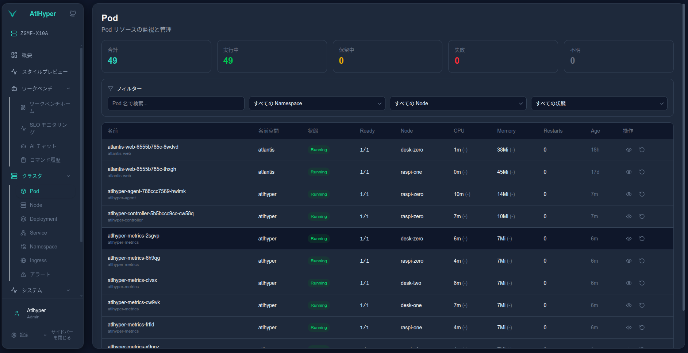
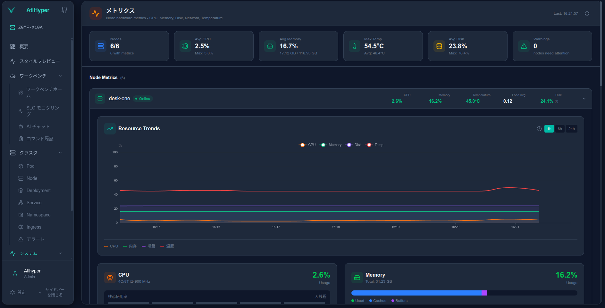
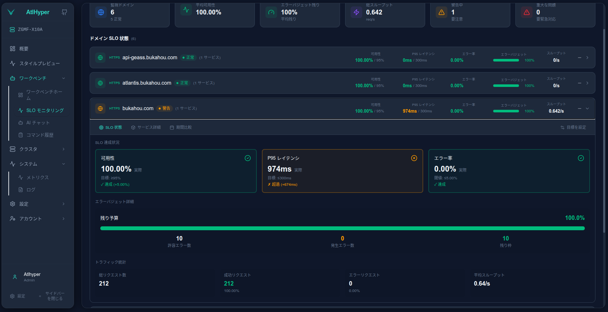

# AtlHyper

**Lightweight Kubernetes Multi-Cluster Monitoring & Operations Platform**

AtlHyper is a monitoring and management platform designed for lightweight Kubernetes environments. It adopts a Master-Agent architecture, supporting unified multi-cluster management, real-time resource monitoring, anomaly detection, SLO tracking, and remote operations.

---

## Features

- **Multi-Cluster Management** — Manage multiple Kubernetes clusters from a single dashboard
- **Real-Time Monitoring** — Live Pod, Node, Deployment status with metrics visualization
- **Anomaly Detection** — Automatic detection of CrashLoopBackOff, OOMKilled, ImagePullBackOff, etc.
- **SLO Monitoring** — Track service availability, latency, and error rates based on Ingress metrics
- **Alert Notifications** — Email (SMTP) and Slack (Webhook) integrations
- **Remote Operations** — Execute kubectl commands, restart pods, scale deployments remotely
- **AI Assistant** — Natural language interface for cluster operations (optional)
- **Audit Logging** — Complete operation history with user tracking
- **Multi-Language** — English, Chinese, Japanese support

---

## Tech Stack

| Component | Technology | Description |
|-----------|------------|-------------|
| **Master** | Go + Gin + SQLite/MySQL | Central control, data aggregation, API server |
| **Agent** | Go + controller-runtime | Cluster data collection, command execution |
| **Metrics** | Go (DaemonSet) | Node-level metrics collection (CPU, Memory, Disk, Network) |
| **Web** | Next.js 15 + TypeScript + Tailwind CSS | Modern responsive dashboard |

---

## Architecture

```
┌─────────────────────────────────────────────────────────────────────────────┐
│                              AtlHyper Platform                              │
├─────────────────────────────────────────────────────────────────────────────┤
│                                                                             │
│   ┌─────────────┐     ┌─────────────────────────────────────────────────┐   │
│   │   Web UI    │────▶│                    Master                       │   │
│   │  (Next.js)  │◀────│                                                 │   │
│   └─────────────┘     │  ┌─────────┐  ┌──────────┐  ┌───────────────┐   │   │
│                       │  │ Gateway │  │ DataHub  │  │   Services    │   │   │
│                       │  │  (API)  │  │ (Memory) │  │ (SLO/Alert)   │   │   │
│                       │  └─────────┘  └──────────┘  └───────────────┘   │   │
│                       │                     │                           │   │
│                       │              ┌──────┴──────┐                    │   │
│                       │              │   Database  │                    │   │
│                       │              │(SQLite/MySQL)│                   │   │
│                       └──────────────┴──────────────┴───────────────────┘   │
│                                          │                                  │
│            ┌─────────────────────────────┼─────────────────────────────┐    │
│            │                             │                             │    │
│            ▼                             ▼                             ▼    │
│   ┌─────────────────┐         ┌─────────────────┐         ┌─────────────────┐
│   │  Agent (K8s A)  │         │  Agent (K8s B)  │         │  Agent (K8s N)  │
│   │                 │         │                 │         │                 │
│   │  ┌───────────┐  │         │  ┌───────────┐  │         │  ┌───────────┐  │
│   │  │  Source   │  │         │  │  Source   │  │         │  │  Source   │  │
│   │  │ ├─ Event  │  │         │  │ ├─ Event  │  │         │  │ ├─ Event  │  │
│   │  │ ├─ Snapshot│ │         │  │ ├─ Snapshot│ │         │  │ ├─ Snapshot│ │
│   │  │ └─ Metrics│  │         │  │ └─ Metrics│  │         │  │ └─ Metrics│  │
│   │  ├───────────┤  │         │  ├───────────┤  │         │  ├───────────┤  │
│   │  │  Executor │  │         │  │  Executor │  │         │  │  Executor │  │
│   │  └───────────┘  │         │  └───────────┘  │         │  └───────────┘  │
│   └────────┬────────┘         └────────┬────────┘         └────────┬────────┘
│            │                           │                           │        │
│            ▼                           ▼                           ▼        │
│   ┌─────────────────┐         ┌─────────────────┐         ┌─────────────────┐
│   │   Kubernetes    │         │   Kubernetes    │         │   Kubernetes    │
│   │    Cluster A    │         │    Cluster B    │         │    Cluster N    │
│   │                 │         │                 │         │                 │
│   │ ┌─────────────┐ │         │ ┌─────────────┐ │         │ ┌─────────────┐ │
│   │ │   Metrics   │ │         │ │   Metrics   │ │         │ │   Metrics   │ │
│   │ │ (DaemonSet) │ │         │ │ (DaemonSet) │ │         │ │ (DaemonSet) │ │
│   │ └─────────────┘ │         │ └─────────────┘ │         │ └─────────────┘ │
│   └─────────────────┘         └─────────────────┘         └─────────────────┘
└─────────────────────────────────────────────────────────────────────────────┘
```

---

## Data Flow

AtlHyper consists of four modules with distinct data flows:

### 1. Agent Data Flow (4 Streams)

```
┌──────────────────────────────────────────────────────────────────────────┐
│                        Agent → Master Data Flows                         │
├──────────────────────────────────────────────────────────────────────────┤
│                                                                          │
│  [Event Stream]                                                          │
│  K8s Watch ──▶ Abnormal Filter ──▶ DataHub ──▶ Pusher ──▶ Master        │
│  • Detects: CrashLoop, OOM, ImagePull, NodeNotReady, etc.               │
│                                                                          │
│  [Snapshot Stream]                                                       │
│  SDK.List() ──▶ Snapshot ──▶ Pusher ──▶ Master                          │
│  • Resources: Pods, Nodes, Deployments, Services, Ingresses, etc.       │
│                                                                          │
│  [Metrics Stream]                                                        │
│  Metrics DaemonSet ──▶ Agent Gateway ──▶ Receiver ──▶ Pusher ──▶ Master │
│  • Node metrics: CPU, Memory, Disk, Network per node                    │
│                                                                          │
│  [Command Stream]                                                        │
│  Master ──▶ Agent Gateway ──▶ Executor ──▶ K8s SDK ──▶ Result ──▶ Master│
│  • Operations: Restart Pod, Scale Deployment, Cordon Node, etc.         │
│                                                                          │
└──────────────────────────────────────────────────────────────────────────┘
```

### 2. Metrics DaemonSet Data Flow

```
┌──────────────────────────────────────────────────────────────────────────┐
│                     Metrics Collector (Per Node)                         │
├──────────────────────────────────────────────────────────────────────────┤
│                                                                          │
│  ┌─────────────┐    ┌─────────────┐    ┌─────────────┐                   │
│  │ /proc/stat  │    │ /proc/meminfo│   │/proc/diskstats│                 │
│  │ /proc/net   │    │   syscall   │    │/proc/mounts │                   │
│  └──────┬──────┘    └──────┬──────┘    └──────┬──────┘                   │
│         │                  │                  │                          │
│         ▼                  ▼                  ▼                          │
│  ┌─────────────────────────────────────────────────────┐                 │
│  │              Metrics Collector (Go)                 │                 │
│  │  • CPU: usage%, per-core, load average              │                 │
│  │  • Memory: used, available, cached, buffers         │                 │
│  │  • Disk: space, IO rate, IOPS, utilization          │                 │
│  │  • Network: bytes/packets in/out per interface      │                 │
│  └──────────────────────────┬──────────────────────────┘                 │
│                             │                                            │
│                             ▼                                            │
│                    POST /metrics/push                                    │
│                             │                                            │
│                             ▼                                            │
│                    ┌─────────────────┐                                   │
│                    │  Agent (同节点)  │                                   │
│                    └─────────────────┘                                   │
│                                                                          │
└──────────────────────────────────────────────────────────────────────────┘
```

### 3. Master Data Flow (3 Streams)

```
┌──────────────────────────────────────────────────────────────────────────┐
│                         Master Data Streams                              │
├──────────────────────────────────────────────────────────────────────────┤
│                                                                          │
│  [1. Cluster Snapshot — In-Memory (DataHub)]                             │
│  ─────────────────────────────────────────────────────────────────────── │
│  Agent ──▶ AgentSDK ──▶ Processor ──▶ DataHub (Memory)                  │
│                                            │                             │
│  Purpose: Real-time query of Pods/Nodes    ◀── Web API queries          │
│  Retention: Latest snapshot only                                         │
│                                                                          │
│  [2. Command Dispatch — Message Queue]                                   │
│  ─────────────────────────────────────────────────────────────────────── │
│  User/AI ──▶ API ──▶ CommandBus ──▶ Agent executes                      │
│                          │                                               │
│  Purpose: Remote ops     Agent ──▶ Result ──▶ CommandBus ──▶ API        │
│  Retention: Transient                                                    │
│                                                                          │
│  [3. Persistent Data — Database]                                         │
│  ─────────────────────────────────────────────────────────────────────── │
│  Agent ──▶ Processor ──┬──▶ Events ──▶ DB (event_history)               │
│                        ├──▶ SLO Metrics ──▶ DB (slo_* tables)           │
│                        └──▶ Node Metrics ──▶ DB (node_metrics_history)  │
│                                    │                                     │
│  Purpose: Historical analysis      ◀── Trend/SLO API queries            │
│  Retention: 30-180 days (configurable)                                   │
│                                                                          │
└──────────────────────────────────────────────────────────────────────────┘
```

### 4. Web Frontend Data Flow

```
┌──────────────────────────────────────────────────────────────────────────┐
│                         Web Frontend Flow                                │
├──────────────────────────────────────────────────────────────────────────┤
│                                                                          │
│  ┌─────────────┐    ┌─────────────┐    ┌─────────────┐                   │
│  │   Browser   │    │  Next.js    │    │   Master    │                   │
│  │             │───▶│  Middleware │───▶│   Gateway   │                   │
│  │             │◀───│  (Proxy)    │◀───│   (API)     │                   │
│  └─────────────┘    └─────────────┘    └─────────────┘                   │
│                                                                          │
│  • Authentication: JWT token in localStorage                             │
│  • API Proxy: /api/v2/* → Master:8080 (runtime configured)              │
│  • State: Zustand for global state management                            │
│  • Real-time: Polling with configurable intervals                        │
│                                                                          │
└──────────────────────────────────────────────────────────────────────────┘
```

---

## Screenshots

### Cluster Overview
Real-time cluster health, resource usage, and recent alerts at a glance.


### Pod Management
List, filter, and manage pods across namespaces with detailed status.



### Alert Dashboard
View and analyze cluster alerts with filtering and AI-powered analysis.


### Node Metrics
Detailed node-level metrics with historical trends.



### SLO Monitoring
Track service level objectives based on Ingress metrics.




---

## Deployment

### Prerequisites

- Go 1.21+
- Node.js 18+
- Kubernetes cluster(s) for Agent deployment
- Docker (for containerized deployment)

### Quick Start (Development)

**1. Start Master**
```bash
export MASTER_ADMIN_USERNAME=admin
export MASTER_ADMIN_PASSWORD=$(openssl rand -base64 16)
export MASTER_JWT_SECRET=$(openssl rand -base64 32)

cd cmd/atlhyper_master_v2
go run main.go
# Gateway: :8080, AgentSDK: :8081
```

**2. Start Agent (in K8s cluster)**
```bash
cd cmd/atlhyper_agent_v2
go run main.go \
  --cluster-id=my-cluster \
  --master=http://<MASTER_IP>:8081
```

**3. Start Web**
```bash
cd atlhyper_web
npm install && npm run dev
# Access: http://localhost:3000
```

### Kubernetes Deployment (Helm)

```bash
# Add Helm repo (if published)
helm repo add atlhyper https://charts.atlhyper.io

# Install Master
helm install atlhyper-master atlhyper/atlhyper \
  --set master.admin.username=admin \
  --set master.admin.password=<YOUR_PASSWORD> \
  --set master.jwt.secret=<YOUR_SECRET>

# Install Agent (per cluster)
helm install atlhyper-agent atlhyper/atlhyper-agent \
  --set agent.clusterId=production \
  --set agent.masterUrl=http://atlhyper-master:8081
```

### Kubernetes Deployment (Manifests)

Deploy order: **Master → Agent → Metrics → Web**

```bash
cd deploy/k8s

# 1. Create namespace and config
kubectl apply -f atlhyper-config.yaml

# 2. Deploy Master
kubectl apply -f atlhyper-Master.yaml

# 3. Deploy Agent
kubectl apply -f atlhyper-agent.yaml

# 4. Deploy Metrics (DaemonSet)
kubectl apply -f atlhyper-metrics.yaml

# 5. Deploy Web
kubectl apply -f atlhyper-web.yaml

# 6. (Optional) Traefik IngressRoute
kubectl apply -f atlhyper-traefik.yaml
```

### Configuration Reference

#### Master Environment Variables

| Variable | Required | Default | Description |
|----------|----------|---------|-------------|
| `MASTER_ADMIN_USERNAME` | Yes | - | Admin username |
| `MASTER_ADMIN_PASSWORD` | Yes | - | Admin password |
| `MASTER_JWT_SECRET` | Yes | - | JWT signing key |
| `MASTER_GATEWAY_PORT` | No | `8080` | Web/API port |
| `MASTER_AGENTSDK_PORT` | No | `8081` | Agent data port |
| `MASTER_DB_TYPE` | No | `sqlite` | Database type |
| `MASTER_DB_DSN` | No | - | MySQL/PostgreSQL DSN |
| `MASTER_LOG_LEVEL` | No | `info` | Log level |

#### Agent Configuration

| Flag | Required | Description |
|------|----------|-------------|
| `--cluster-id` | Yes | Unique cluster identifier |
| `--master` | Yes | Master AgentSDK URL |

#### Metrics DaemonSet

The Metrics collector is automatically deployed as a DaemonSet and reports to the local Agent. Configuration via ConfigMap:

| Variable | Default | Description |
|----------|---------|-------------|
| `METRICS_AGENT_URL` | `http://atlhyper-agent:8082` | Agent metrics endpoint |
| `METRICS_PUSH_INTERVAL` | `15s` | Push interval |

---

## Project Structure

```
atlhyper/
├── atlhyper_master_v2/       # Master (Central Control)
│   ├── gateway/              # HTTP API (Web + AgentSDK)
│   ├── datahub/              # In-memory data store
│   ├── database/             # Persistent storage (SQLite/MySQL)
│   ├── service/              # Business logic (SLO, Alert)
│   ├── ai/                   # AI assistant integration
│   └── config/               # Configuration management
│
├── atlhyper_agent_v2/        # Agent (Cluster Proxy)
│   ├── source/               # Data sources
│   │   ├── event/            # K8s event watcher
│   │   ├── snapshot/         # Resource snapshots
│   │   └── metrics/          # Metrics receiver
│   ├── executor/             # Command execution
│   ├── sdk/                  # K8s operations
│   └── pusher/               # Data push scheduler
│
├── atlhyper_metrics_v2/      # Metrics Collector (DaemonSet)
│   ├── collector/            # CPU, Memory, Disk, Network
│   └── pusher/               # Push to Agent
│
├── atlhyper_web/             # Web Frontend
│   ├── src/app/              # Next.js pages
│   ├── src/components/       # React components
│   ├── src/api/              # API client
│   └── src/i18n/             # Internationalization
│
├── model_v2/                 # Shared data models
├── cmd/                      # Entry points
└── deploy/                   # Deployment configs
    ├── helm/                 # Helm charts
    └── k8s/                  # K8s manifests
```

---

## Security

### Sensitive Information

- **Never hardcode** API keys, passwords, or secrets in code
- Use environment variables for all credentials
- AI API keys are stored encrypted in database (configured via Web UI)

### Pre-commit Check

```bash
# Scan for potential API key leaks
grep -rE "sk-[a-zA-Z0-9]{20,}|AIza[a-zA-Z0-9]{30,}" \
  --include="*.go" --include="*.ts" --include="*.tsx" .
```

### Files Ignored by .gitignore

- `atlhyper_master_v2/database/sqlite/data/` — Database files
- `atlhyper_web/.env.local` — Local environment
- `*.db` — All SQLite databases

---

## License

MIT

---

## Links

- [GitHub Repository](https://github.com/bukahou/atlhyper)
