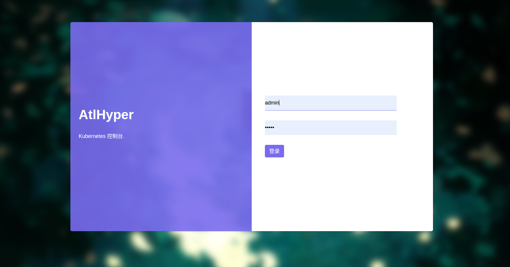
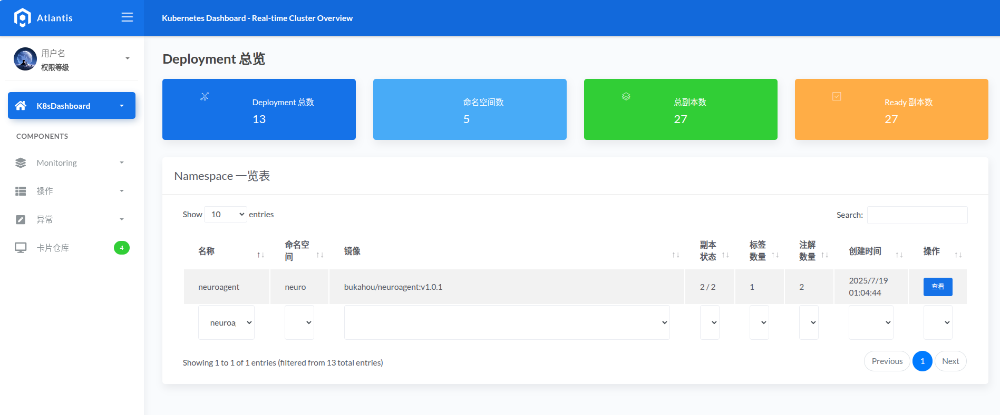
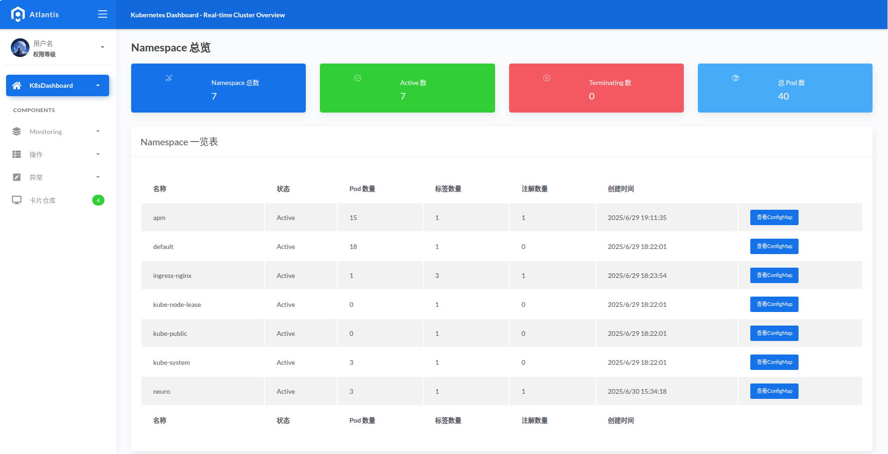
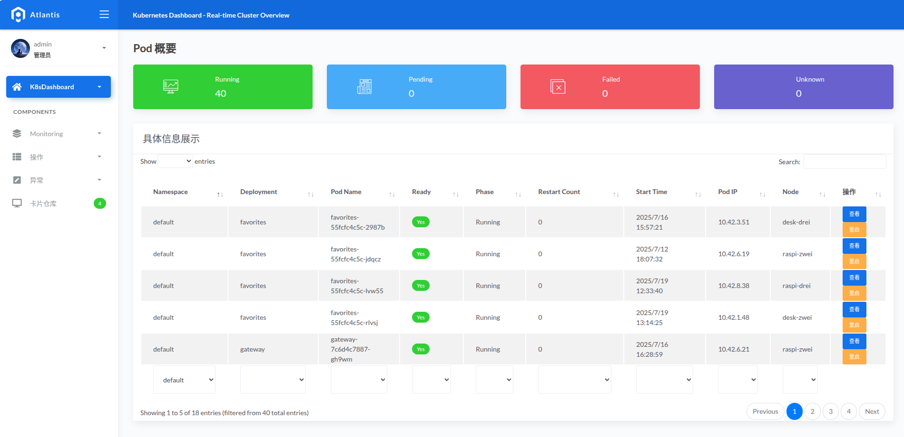
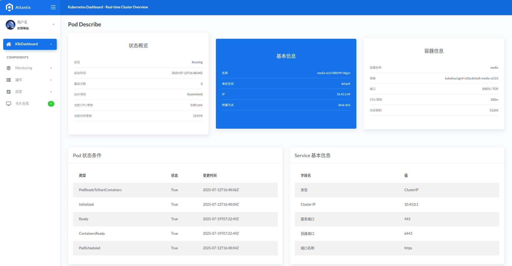
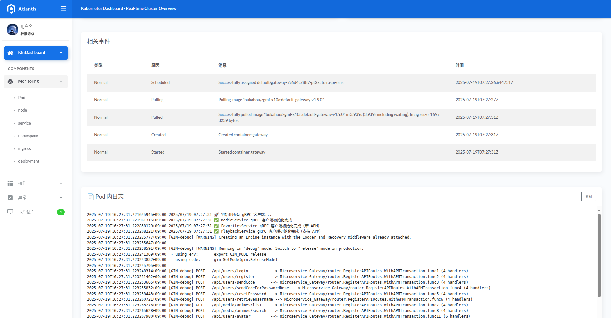
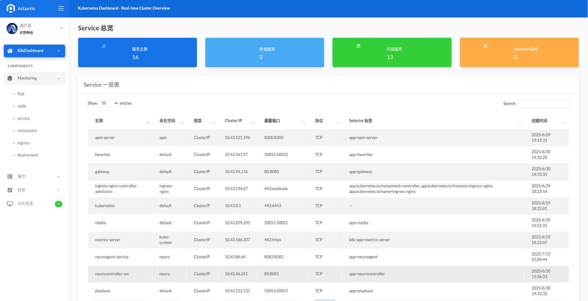
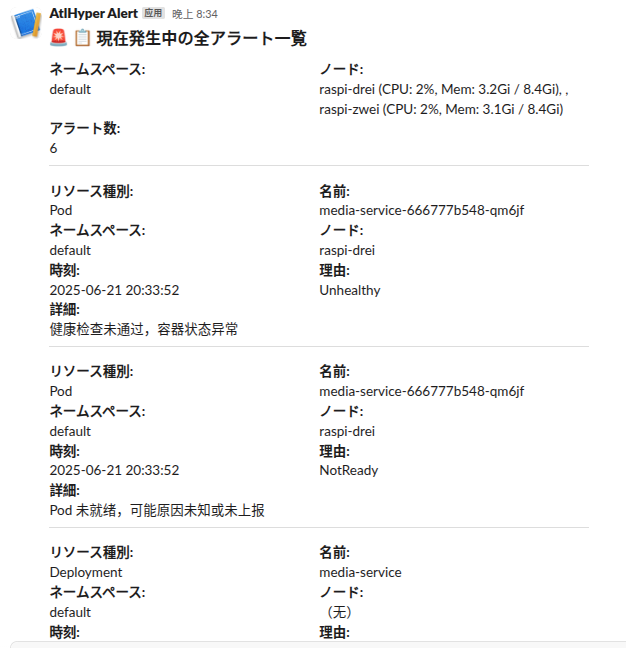
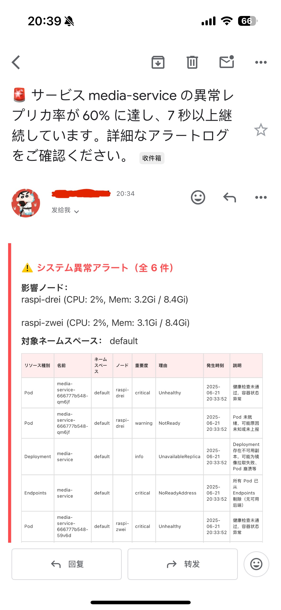
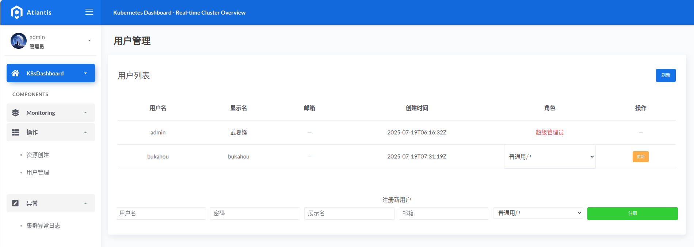

# NeuroController · Plugin-based Kubernetes Anomaly Detection and Alert Controller

NeuroController · プラグインベースの Kubernetes 異常検知＆アラート制御コントローラー

---

## 📌 Project Overview | プロジェクト概要

**NeuroController** is a lightweight Kubernetes anomaly detection and control platform that runs on edge devices such as Raspberry Pi. It fills the gaps left by traditional APM and Prometheus in anomaly response. Featuring "event-driven, plugin-based, visualized, and self-healing" capabilities, it is suitable for private and edge cloud environments.
**NeuroController** は Raspberry Pi などのエッジデバイスでも動作可能な、軽量の Kubernetes 異常検知・制御プラットフォームです。従来の APM や Prometheus では対応が難しい異常イベントへの反応を補完し、「イベント駆動・プラグイン化・可視化・自己修復」の機能を持ち、プライベートクラウドやエッジクラウドなど様々な環境に対応可能です。

- GitHub: [https://github.com/bukahou/kubeWatcherPlugin](https://github.com/bukahou/kubeWatcherPlugin)
- DockerHub: [https://hub.docker.com/r/bukahou/neurocontroller](https://hub.docker.com/r/bukahou/neurocontroller)

---

## 🏗️ Architecture Modules | システム構成モジュール

### 1. **Watcher Plugin System**

- Real-time monitoring of resources such as Pod, Deployment, Node, Endpoint, and Event
- Plugin-based registration and controller lifecycle management
- Built-in anomaly detection and standardized event generation

### 1. **Watcher プラグインシステム**

- Pod、Deployment、Node、Endpoint、Event などのリソースをリアルタイム監視
- プラグインとしての登録とコントローラーのライフサイクル管理をサポート
- 内蔵の異常検知ロジックと標準化されたイベント生成

### 2. **Diagnosis Engine**

- Aggregates, deduplicates, and evaluates the severity of collected events
- Maintains event pool and "new event detection" mechanism to prevent redundant alerts

### 2. **Diagnosis エンジン**

- 収集されたイベントの集約、重複排除、重大度評価を実施
- イベントプールと「新規イベント判定」メカニズムにより重複通知を防止

### 3. **Alert Dispatcher**

- Supports asynchronous multi-channel alerts via Slack, Email, and Webhook
- Includes throttling, duplicate prevention, and priority differentiation (light/heavy)

### 3. **Alert Dispatcher アラート分配モジュール**

- Slack・Email・Webhook による非同期マルチチャネル通知をサポート
- スロットリング、重複防止、優先度分類（軽度/重度）機能を内蔵

### 4. **UI API Server (Frontend-Backend Separation)**

- Provides RESTful APIs for frontend data display and interaction
- Supports endpoints for resource lists, event overviews, namespace/node views, etc.
- Uses JWT token for authentication and permission control
- Role-based access control: user / admin / super admin
- Deployment scaling (replicas/images) and user management supported

### 4. **UI API サーバー（フロントエンドとバックエンドの分離）**

- フロントエンドとのデータ連携を行う RESTful API を提供
- リソース一覧・異常ログ・イベント概要・Namespace/Node ビュー等に対応
- JWT トークンによる認証と認可
- ユーザーの権限管理機能（一般 / 管理者 / スーパーユーザー）を実装
- Deployment の調整（レプリカ数・イメージ）やユーザー管理にも対応

### 5. **Agent Master-Slave Architecture (Experimental)**

- Controller acts as central node for coordination
- Agents run independently on each node for state reporting, sub-cluster collection, remote commands

### 5. **Agent マスター・スレーブ構成（実験中）**

- コントローラーが中央からスケジューリングを実行
- Agent は各ノード上で独立稼働し、状態報告・部分クラスタ収集・リモート指令実行に対応

### 6. **SQLite Persistence Layer**

- All anomaly events and user data are persisted locally
- Shared `db/models` structure across modules enhances reuse and maintainability

### 6. **SQLite データ永続層**

- 異常イベントとユーザーデータをローカルに永続化
- 複数モジュール間で共通の `db/models` モデル構造を採用し、再利用性と保守性を向上

---

## 🖼️ UI 展示示例 Screenshots

### 集群总览 Dashboard

Login Page


### Cluster Dashboard

Displays node status, Pod status, K8s version, and alert summary.


### Deployment Summary

Shows Deployment count and replica status across namespaces.


### Namespace View

Displays resource information for all namespaces.


### Pod Summary

Lists Pods grouped by namespace.


### Pod Detail View

Summarizes status, services, and container configuration.


### Pod Logs & Events

Aggregated view of events and stdout logs.


### Service View

Displays all ClusterIP/NodePort services.


### Slack Alert Example

Lightweight alert notification using Slack BlockKit format.


### Email Alert Template

HTML email template sent during system anomalies.


### User Management Interface

Interface for managing user roles and permissions.


---

## ⚙️ Deployment | デプロイ構成

The following is a complete list of required Kubernetes manifests, including the main controller, agents, services, and configuration.
以下は、NeuroController の本体・Agent・サービス公開・設定を含む、Kubernetes リソース定義の完全な一覧です。

---

### 🔐 1. NeuroAgent 权限 - ClusterRoleBinding（最大权限）

```yaml
apiVersion: rbac.authorization.k8s.io/v1
kind: ClusterRoleBinding
metadata:
  name: neuroagent-cluster-admin
subjects:
  - kind: ServiceAccount
    name: default
    namespace: neuro
roleRef:
  kind: ClusterRole
  name: cluster-admin
  apiGroup: rbac.authorization.k8s.io
```

---

### 🚀 2. NeuroAgent Deployment

```yaml
apiVersion: apps/v1
kind: Deployment
metadata:
  name: neuroagent
  namespace: neuro
  labels:
    app: neuroagent
spec:
  replicas: 2 # 可根据节点数量调整
  selector:
    matchLabels:
      app: neuroagent
  template:
    metadata:
      labels:
        app: neuroagent
    spec:
      serviceAccountName: default
      containers:
        - name: neuroagent
          image: bukahou/neuroagent:v1.0.1
          imagePullPolicy: Always
          ports:
            - containerPort: 8082
          resources:
            requests:
              memory: "64Mi"
              cpu: "50m"
            limits:
              memory: "128Mi"
              cpu: "100m"
          envFrom:
            - configMapRef:
                name: neuro-config
```

---

### 🌐 3. NeuroAgent ClusterIP Service（供中心访问）

```yaml
apiVersion: v1
kind: Service
metadata:
  name: neuroagent-service
  namespace: neuro
spec:
  selector:
    app: neuroagent
  type: ClusterIP
  ports:
    - name: agent-api
      protocol: TCP
      port: 8082
      targetPort: 8082
```

---

### 🎯 4. NeuroController Deployment（主控制器）

```yaml
apiVersion: apps/v1
kind: Deployment
metadata:
  name: neurocontroller
  namespace: neuro
  labels:
    app: neurocontroller
spec:
  replicas: 1
  selector:
    matchLabels:
      app: neurocontroller
  template:
    metadata:
      labels:
        app: neurocontroller
    spec:
      nodeSelector:
        kubernetes.io/hostname: desk-eins
      tolerations:
        - key: "node-role.kubernetes.io/control-plane"
          operator: "Exists"
          effect: "NoSchedule"
        - key: "node-role.kubernetes.io/master"
          operator: "Exists"
          effect: "NoSchedule"
      containers:
        - name: neurocontroller
          image: bukahou/neurocontroller:v2.0.1
          imagePullPolicy: Always
          ports:
            - containerPort: 8081 # 📌 控制面板 UI 服务监听端口
          resources:
            requests:
              memory: "128Mi"
              cpu: "100m"
            limits:
              memory: "256Mi"
              cpu: "200m"
          envFrom:
            - configMapRef:
                name: neuro-config
```

---

### 🌐 5. NeuroController NodePort Service

```yaml
apiVersion: v1
kind: Service
metadata:
  name: neurocontroller-nodeport
  namespace: neuro
spec:
  selector:
    app: neurocontroller
  type: NodePort
  ports:
    - name: ui
      port: 8081 # Service 内部端口
      targetPort: 8081 # 容器内监听端口
      nodePort: 30080 # Node 上暴露给外部的端口
```

---

### 🧾 6. ConfigMap 配置项（共用）

```yaml
apiVersion: v1
kind: ConfigMap
metadata:
  name: neuro-config
  namespace: neuro
data:
  # === 🛰️ Agent 访问配置 ===
  AGENT_ENDPOINTS: "http://neuroagent-service.neuro.svc.cluster.local:8082"

  # === 📧 邮件配置 ===
  MAIL_USERNAME: "xxxxxxxx@gmail.com"
  MAIL_PASSWORD: "xxxxxxxx"
  MAIL_FROM: "xxxxxxxx@gmail.com"
  MAIL_TO: "xxxxxxxx@gmail.com"

  # Slack Webhook 地址
  SLACK_WEBHOOK_URL: "https://hooks.slack.com/xxxxxxxxxxxxxxxxx"

  # 启用控制项（true/false）
  ENABLE_EMAIL_ALERT: "false"
  ENABLE_SLACK_ALERT: "false"
  ENABLE_WEBHOOK_SERVER: "true"
```

---

- Supports native Kubernetes deployment (Deployment + Service)
- Kubernetes の標準的な Deployment + Service でデプロイ可能です

- Built-in health probes and automatic traceID injection into logs
- ヘルスチェックプローブと traceID のログ自動挿入に対応しています

- Supports automated image builds and canary releases via GitHub Actions + Webhook
- GitHub Actions + Webhook による自動ビルド・段階的なデプロイに対応しています

- Highly configurable: alert policies, channel toggles, mail settings via ConfigMap
- ConfigMap によるアラート設定・チャンネル切替・メール構成などを柔軟に管理できます

---

## 📈 Key Highlights | プロジェクトの特徴

- **Plugin-based anomaly monitoring**: easily extensible targets and diagnosis logic
- **プラグイン化された異常監視**：監視対象や診断ロジックの柔軟な拡張が可能

- **Smart deduplication & alert throttling**: effectively reduces noise
- **インテリジェントな重複排除とアラート間引き**：通知のノイズを大幅に削減

- **Visual UI**: full cluster observability and operational control
- **可視化された UI**：クラスタ全体の観測と操作が可能

- **Lightweight design for low-resource devices**: runs stably on Raspberry Pi
- **軽量設計で低リソース環境に最適**：Raspberry Pi でも安定動作

- **TraceID + syscall tracing support (experimental)**: observability for black-box components
- **traceID + syscall トレースの連携（実験的）**：ブラックボックスなコンポーネントの可観測性を実現

---

## 🧪 Use Cases | 使用ユースケース

- Private cloud / edge cloud / on-prem cluster anomaly detection & visualization
- プライベートクラウド・エッジクラウド・ローカルクラスタでの異常検知と可視化に最適

- Complements metric-based tools (e.g., Prometheus) with event-level insights
- Prometheus 等のメトリクス監視ツールでは補えないイベントレベルの補完

- Agent-based architecture for multi-node monitoring and aggregation
- マルチノード環境における Agent ベースの監視・集約アーキテクチャ

- Educational / experimental platform for Kubernetes observability enhancement
- Kubernetes の可観測性向上を目的とした教育・研究用途にも活用可能
