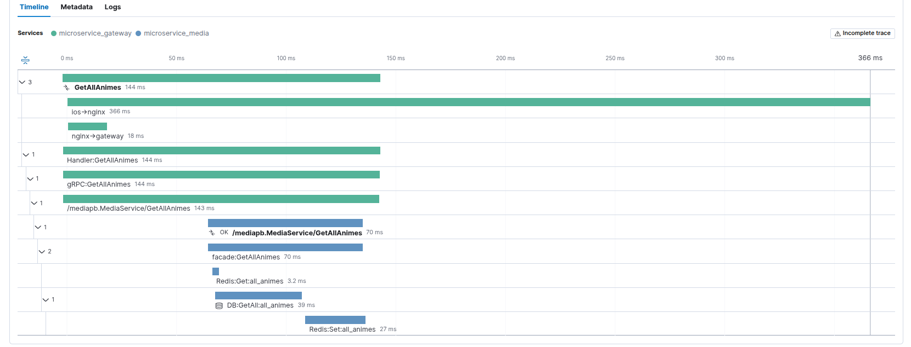

# 🧠 NeuroController ・ Plugin-Based Kubernetes Anomaly Controller 

---

## 🛍️ Overview: End-to-End Observability Strategy

### NeuroController ・三位一体の全栈監視構想（APM＋eBPF＋K8s異常）

NeuroController は、APM による業務トレース、eBPF によるシステムコール収集、Kubernetes 資源の異常監視という三位一体の戦略に基づき、アプリ・システム・クラスタの全層を越える可観測性と制御機構を実現する Go 実装のプラグイン型コントローラです。
さらに、今後は trace + metrics に基づく自動スケーリング・ロールバックや、Node 異常時の cordon/drain などの自徴的復旧機能も展開予定です。

この構成において、Elastic APM + Kibana + Filebeat による業務トレースとログ・メトリクスの統合基盤が NeuroController の土台を構成し、M0〜M1 の機能を補完しています。

### NeuroController: A Unified APM + eBPF + Kubernetes Alerting Architecture

NeuroController delivers full-stack observability by combining three pillars: business trace via APM, system trace via eBPF, and cluster anomaly detection through Kubernetes event watchers. It is a plugin-based controller written in Go, designed to work in resource-constrained environments. Future expansions will include trace-driven autoscaling, rollback policies, and node-level self-healing through cordon/drain mechanisms.

In this architecture, Elastic APM + Kibana + Filebeat provide the underlying trace and metric integration, forming the basis of M0–M1 functionality and enabling precise visibility.

---

## 🧹 Module Overview / モジュール構成

| Module | Name                          | Status      | Description                                              |
| ------ | ----------------------------- | ----------- | -------------------------------------------------------- |
| M0     | Observability Core            | ✅ Done     | Logging, trace injection, APM initialization             |
| M1     | Trace Correlation Engine      | ✅ Done     | Swift → Nginx → Gateway → Backend full trace propagation |
| M2     | NeuroController Control Plane | 🏗️ In Dev   | Pluginized resource watcher + alert engine               |
| M3     | User Behavior Module          | 🛌 Planned  | Client interaction trace & audit logs                    |
| M4     | System-Level Trace Bridge     | ⚙️ In Dev   | eBPF syscall + PID ↔ TraceID mapping (双域橋接)            |
| M5     | SLO Strategy Engine           | 🔬 Research | Policy-based rollback, autoscaling via trace metrics     |
| M6     | Node Self-Healing Engine      | 🔬 Research | Node abnormality → automatic cordon/drain                |

---

## 🖼️ M0–M1: APM Trace Propagation Demo（全リンク業務トレースの可視化）

NeuroController は Swift → Nginx → Gateway → Backend → Redis/TiDB に至るまで、traceID を越した APM チェーンを確立し、各ステージでの遅延を精富に測定できます。



This trace clearly demonstrates:

* 📱 iOS frontend start time and transmission
* 🌐 Nginx ingress and routing latency
* 🧠 Gateway and gRPC internal spans
* 🏢 Redis & TiDB storage backend breakdown

このように、M0（ログと APM 初期化）と M1（trace の end-to-end 伝播）は完全に実装されており、ボトルネック分析と eBPF 連携の基盤となっています。

---

## 📎 M4: System-Level Trace Bridge（双域橋接 / Dual-Domain Binding）

### 🌟 Goals / 目標

* eBPF により syscall を収集し、業務トレースと結びつけ
* 各リクエストごとの syscall レイテンシを可視化
* コンテナとホストシステム層のギャップを補答

### 🧠 Bridge Strategy / 橋接方式

* 【業務トレース領域】: Swift フロントエンドが traceID と timestamp を発行
* 【システムトレース領域】: Agent が PID / TID に基づき syscall を収集
* 【橋接機構】: Agent 側で PID → traceID の一時キャッシュ（プール）を管理
* PID がプール内に存在すれば、収集・時間計測・レポートを実行

### 🚁 Agent Responsibilities / Agent 側

* eBPF を使用し全 syscall を監視
* trace プール内の PID に対してのみフィルタリング
* 短命な PID→traceID キャッシュを TTL で管理
* trace 情報を含む syscall span を controller に送信

### 🛍️ Controller Role / Controller 側

* traceID ごとに syscall span を集縮
* APM 由来のトレースチェーンと結合し Kibana に表示
* メトリクスしきい値による遅延 syscall のアラート化（オプション）

---

この構成は、Raspberry Pi クラスタや軽量クラウド環境でも実行可能であり、最小リソースでも最大の監視可視化能力を発揮するよう設計されています。
This architecture runs on low-resource environments like Raspberry Pi clusters while providing full-spectrum observability and control.

---

## ✨ 現M2ジェクト特徴 / Project Highlights

### ・資源監視プラグインフレーム

### ・Plugin-Based Resource Watcher Framework

* Kubernetesの核心資源毎に個別のWatcherプラグインを提供
* 統一登録と生命周期管理を支援
* `controller-runtime`により従来の同期化イベント構成に対応
* Each core Kubernetes resource is managed by a separate watcher plugin
* All watchers are centrally registered with unified lifecycle management
* Built on `controller-runtime`, supports efficient concurrent event watching

### ・多段階告知モジュール

### ・Multi-Level Alerting System

* 軽量系 (Slack)、固定系、高リスク系 (メール) の3レベルの告知機構
* すべての告知は統一的な構造で出力 (`AlertGroupData`)
* 重複排除、レート制限機能を内蔵
* Built-in lightweight (Slack), strict, and high-risk (Email) alert levels
* Unified `AlertGroupData` format for all alerts
* Deduplication and throttling built-in

### ・ログ清潔・持続化メカニズム

### ・Log Cleaning and Persistence

* 異常イベントをCleanerが調整し、重複や無視可能なログを削除
* 清潔後のログは `/var/log/neurocontroller/cleaned_events.log` にローカル出力
* インタフェース経由の外部分析も支援
* Events are deduplicated and cleaned by a dedicated `Cleaner`
* Logs are persisted at `/var/log/neurocontroller/cleaned_events.log`
* Easy to integrate with external analysis systems

### ・多通信の告知実装

### ・Multi-Channel Alert Notification

* Slack Block Kit形式の軽量通知を支援
* Emailはテンプレートと制限ロジック付き
* 両者は実行時に検知され、同時依存を避ける
* Slack support with Block Kit formatting
* Email alerts with template & rate-limit logic
* Fully independent and concurrent channels

### ・簡潔なKubernetes配備

### ・Lightweight Kubernetes Deployment

* `Deployment` + `ClusterRole` + `Binding` により簡単配備
* 使用リソースは極少、Raspberry Pi 環境に有効
* ConfigMapによりはあゆる設定値が管理可能
* Minimal resource usage (below 256Mi / 200m)
* Designed for Raspberry Pi and edge environments
* All thresholds and configs are managed via ConfigMap

---

## 🗋 モジュール一覧 / Module Overview

| パス                     | 機能概要                 |
| ---------------------- | ----------------         |
| `cmd/neurocontroller/` | プログラム入り口            |
| `internal/watcher/`    | 資源監視プラグイン          |
| `internal/diagnosis/`  | 異常収集 + 清潔            |
| `internal/alerter/`    | 告知解析・トリガー判定       |
| `external/slack/`      | Slack通知モジュール         |
| `external/mailer/`     | Email通知モジュール         |
| `internal/logging/`    | クリーンログ出力            |
| `interfaces/`          | JSON形式統一インターフェース  |
| `config/`              | 告知関連設定               |

---

## 🚀 情報戦略・適用場面 / Use Cases

* Raspberry Pi / K3s など軽量K8sの異常監視コントローラ
* Prometheus の代替となるイベント駆動型ログ型告知基盤
* APMシステムと連携した統合オブザービリティー
* CI/CDと連携した異常時の自動回復、ロールバック等

---

## 📁 目录结构  
## 📁 Directory Structure

```bash
NeuroController/
├── NeuroController
│   ├── build_and_push.sh
│   ├── cmd
│   │   └── neurocontroller
│   │       └── main.go
│   ├── config
│   │   └── config.go
│   ├── Dockerfile
│   ├── docs
│   │   └── CHANGELOG.md
│   ├── external
│   │   ├── bootstrap
│   │   │   ├── email_dispatcher.go
│   │   │   └── slack_dispatcher.go
│   │   ├── bootstrap_external.go
│   │   ├── DockerHub
│   │   ├── mailer
│   │   │   ├── mailer.go
│   │   │   ├── sender.go
│   │   │   ├── template.go
│   │   │   └── throttle.go
│   │   └── slack
│   │       ├── blockkit.go
│   │       ├── sender.go
│   │       ├── slacker.go
│   │       └── throttle.go
│   ├── go.mod
│   ├── go.sum
│   ├── interfaces
│   │   ├── alert_group_lightweight_api.go
│   │   ├── alert_group_strict_api.go
│   │   └── cleaned_event_api.go
│   ├── internal
│   │   ├── alerter
│   │   │   ├── highrisk.go
│   │   │   ├── light.go
│   │   │   └── strict.go
│   │   ├── bootstrap
│   │   │   ├── Diagnosis.go
│   │   │   └── manager.go
│   │   ├── bootstrap_internal.go
│   │   ├── diagnosis
│   │   │   ├── cleaner.go
│   │   │   └── collector.go
│   │   ├── logging
│   │   │   ├── dumper.go
│   │   │   └── writer.go
│   │   ├── monitor
│   │   │   ├── health_checker.go
│   │   │   └── metrics_collector.go
│   │   ├── types
│   │   │   ├── alert_notification.go
│   │   │   ├── logevent.go
│   │   │   └── monitoring_state.go
│   │   ├── utils
│   │   │   ├── deployment_util.go
│   │   │   ├── exception_window.go
│   │   │   ├── k8s_client.go
│   │   │   ├── metrics_client.go
│   │   │   └── service_util.go
│   │   └── watcher
│   │       ├── abnormal
│   │       │   ├── abnormal_utils.go
│   │       │   ├── deployment_abnormal.go
│   │       │   ├── endpoint_abnormal.go
│   │       │   ├── event_abnormal.go
│   │       │   ├── node_abnormal.go
│   │       │   ├── pod_abnormal.go
│   │       │   └── service_abnormal.go
│   │       ├── deployment
│   │       │   ├── deployment_watcher.go
│   │       │   └── register.go
│   │       ├── endpoint
│   │       │   ├── endpoint_watcher.go
│   │       │   └── register.go
│   │       ├── event
│   │       │   ├── event_watcher.go
│   │       │   └── register.go
│   │       ├── node
│   │       │   ├── node_watcher.go
│   │       │   └── register.go
│   │       ├── pod
│   │       │   ├── pod_watcher.go
│   │       │   └── register.go
│   │       ├── register.go
│   │       └── service
│   │           ├── register.go
│   │           └── service_watcher.go
│   └── logs
│       └── cleaned_events.log
└── README.md


## 📊 例：構造化ログの出力 / Example: Structured Alert Logs

NeuroController の実行中に記録された構造化告知ログの一部脱敏化サンプルです:
Below is a sample (sanitized) of structured alert logs recorded by NeuroController at runtime:

```json
{
  "category": "Condition",
  "eventTime": "2025-06-09T08:42:05Z",
  "kind": "Pod",
  "message": "Pod 未準備、可能原因未知または未報告",
  "name": "<pod-name>",
  "namespace": "default",
  "reason": "NotReady",
  "severity": "warning",
  "time": "2025-06-09T08:42:20Z"
}
{
  "category": "Warning",
  "eventTime": "2025-06-09T08:42:05Z",
  "kind": "Deployment",
  "message": "Deployment に不可用レプリカが存在、イメージプル失敗やPodクラッシュの可能性",
  "name": "<deployment-name>",
  "namespace": "default",
  "reason": "UnavailableReplica",
  "severity": "info",
  "time": "2025-06-09T08:42:20Z"
}
{
  "category": "Endpoint",
  "eventTime": "2025-06-09T08:42:06Z",
  "kind": "Endpoints",
  "message": "すべてのPodがEndpointsから除外された (利用可能なバックエンドがなし)",
  "name": "<service-name>",
  "namespace": "default",
  "reason": "NoReadyAddress",
  "severity": "critical",
  "time": "2025-06-09T08:42:20Z"
}
```

これらのログは、Pod から Deployment 、Endpoint への告知チェーンを可視化し、根本原因の解析や自動対応シナリオの起点となります。
These logs visualize the alert chain from Pod to Deployment to Endpoint, enabling downstream root cause analysis and triggering of automated response strategies.


# 🕸️ NeuroController 利用ガイド · Usage Guide

---

## ✅ 方法①：ローカル開発テスト · Local Development

### 📂 kubeconfig ファイルの取得 · Obtain kubeconfig File

Kubernetes（例：K3s）クラスタから kubeconfig ファイルをエクスポートします（例：`admin-k3s.yaml`）。
Export your kubeconfig from the Kubernetes cluster (e.g., K3s), e.g., `admin-k3s.yaml`.

### 🛠️ 環境変数の設定 · Set Environment Variable

環境変数 `KUBECONFIG` にパスを設定し、コントローラがクラスタへ接続できるようにします：
Set the file path to the `KUBECONFIG` environment variable so the controller can connect to the cluster:

```bash
export KUBECONFIG=/path/to/admin-k3s.yaml
```

### 🚀 コントローラの起動 · Run the Controller

以下のコマンドで NeuroController を直接起動します：
Run NeuroController directly via Go:

```bash
go run ./cmd/neurocontroller/main.go
```

---

## ✅ 方法②：公開イメージからのデプロイ · Deploy from Public Image

Docker Hub 上にある公開イメージ `bukahou/neurocontroller:v1.1.0` をそのまま使用してデプロイ可能です。以下は `Deployment` および `ClusterRoleBinding` の完全な例です：
You can deploy directly using the public Docker Hub image `bukahou/neurocontroller:v1.1.0`. Below is a complete example `Deployment` and `ClusterRoleBinding`:

```yaml
# ===============================
# 🔐 NeuroController - ClusterRole（アクセス権定義）
# ===============================
apiVersion: rbac.authorization.k8s.io/v1
kind: ClusterRole
metadata:
  name: neurocontroller-role
rules:
  - apiGroups: [""]
    resources: ["pods", "nodes", "services", "events", "endpoints"]
    verbs: ["get", "list", "watch"]
  - apiGroups: ["apps"]
    resources: ["deployments", "replicasets"]
    verbs: ["get", "list", "watch"]
---
# ===============================
# 🔗 ClusterRoleBinding（controller-ns ネームスペースの default SA に付与）
# ===============================
apiVersion: rbac.authorization.k8s.io/v1
kind: ClusterRoleBinding
metadata:
  name: neurocontroller-binding
subjects:
  - kind: ServiceAccount
    name: default
    namespace: controller-ns
roleRef:
  kind: ClusterRole
  name: neurocontroller-role
  apiGroup: rbac.authorization.k8s.io
---
# ===============================
# 🚀 NeuroController - Deployment（コントローラ本体のデプロイ）
# ===============================
apiVersion: apps/v1
kind: Deployment
metadata:
  name: neurocontroller
  namespace: controller-ns
  labels:
    app: neurocontroller
  annotations:
    neurocontroller.version.latest: "bukahou/neurocontroller:v1.1.0"
    neurocontroller.version.previous: "bukahou/neurocontroller:v1.0.0"
spec:
  replicas: 1
  selector:
    matchLabels:
      app: neurocontroller
  template:
    metadata:
      labels:
        app: neurocontroller
    spec:
      serviceAccountName: default

      nodeSelector:
        kubernetes.io/hostname: node-1

      tolerations:
        - key: "node-role.kubernetes.io/control-plane"
          operator: "Exists"
          effect: "NoSchedule"
        - key: "node-role.kubernetes.io/master"
          operator: "Exists"
          effect: "NoSchedule"

      containers:
        - name: neurocontroller
          image: bukahou/neurocontroller:v1.1.0
          imagePullPolicy: Always
          resources:
            requests:
              memory: "128Mi"
              cpu: "100m"
            limits:
              memory: "256Mi"
              cpu: "200m"
          volumeMounts:
            - name: neuro-log
              mountPath: /var/log/neurocontroller
          envFrom:
            - configMapRef:
                name: neurocontroller-config

      volumes:
        - name: neuro-log
          hostPath:
            path: /var/log/neurocontroller
            type: DirectoryOrCreate
---
# ===============================
# 🛠 NeuroController - ConfigMap（環境設定）
# ===============================
apiVersion: v1
kind: ConfigMap
metadata:
  name: neurocontroller-config
  namespace: controller-ns
data:
  # =======================
  # 🔧 診断関連の設定
  # =======================
  DIAGNOSIS_CLEAN_INTERVAL: "5s"             # クリーンアップ処理の実行間隔
  DIAGNOSIS_WRITE_INTERVAL: "6s"             # ログファイル書き込み間隔
  DIAGNOSIS_RETENTION_RAW_DURATION: "10m"    # 元イベントの保持期間
  DIAGNOSIS_RETENTION_CLEANED_DURATION: "5m" # クリーン済みイベントの保持期間
  DIAGNOSIS_UNREADY_THRESHOLD_DURATION: "7s" # アラート発報のしきい値時間
  DIAGNOSIS_ALERT_DISPATCH_INTERVAL: "5s"    # メール送信のポーリング間隔
  DIAGNOSIS_UNREADY_REPLICA_PERCENT: "0.6"   # レプリカ異常割合のアラート閾値（0〜1）

  # =======================
  # 📡 Kubernetes API ヘルスチェック
  # =======================
  KUBERNETES_API_HEALTH_CHECK_INTERVAL: "15s"  # /healthz のチェック間隔

  # =======================
  # 📬 メールアラート設定
  # =======================
  MAIL_SMTP_HOST: "smtp.gmail.com"                 # SMTP サーバホスト名
  MAIL_SMTP_PORT: "587"                            # SMTP ポート番号
  MAIL_USERNAME: "<your_email_username>"           # メールアカウントのユーザー名
  MAIL_PASSWORD: "<your_app_password_or_token>"    # アプリパスワードやトークン
  MAIL_FROM: "neuro@example.com"                   # 送信元メールアドレス
  MAIL_TO: "user1@example.com,user2@example.com"   # 送信先（カンマ区切り）
  ENABLE_EMAIL_ALERT: "true"                       # メールアラート有効化（true/false）

  # =======================
  # 💬 Slack アラート設定
  # =======================
  SLACK_WEBHOOK_URL: "https://hooks.slack.com/services/XXX/YYY/ZZZ" # Webhook URL
  SLACK_ALERT_DISPATCH_INTERVAL: "5s"           # Slack 通知の送信間隔
  ENABLE_SLACK_ALERT: "true"                    # Slackアラート有効化（true/false）
```

## 📦 Deployment マニフェストの作成 · Write Deployment Manifest

クラスタの構成に応じて Deployment マニフェストを自作し、イメージを利用して適用してください。
Write a Deployment manifest using the pushed image and apply it to your cluster.

さらなる支援や構成例の提供が必要な場合は、いつでもメンテナにご連絡ください。
If you need more help or example manifests, feel free to reach out to the maintainer.
