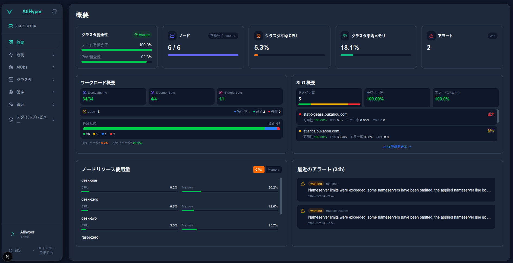
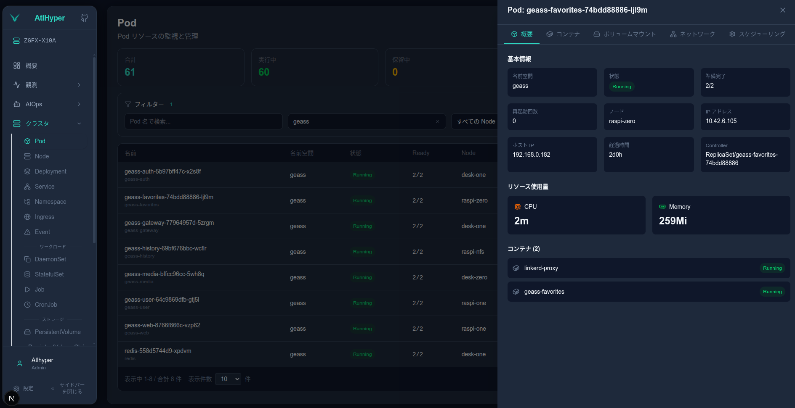
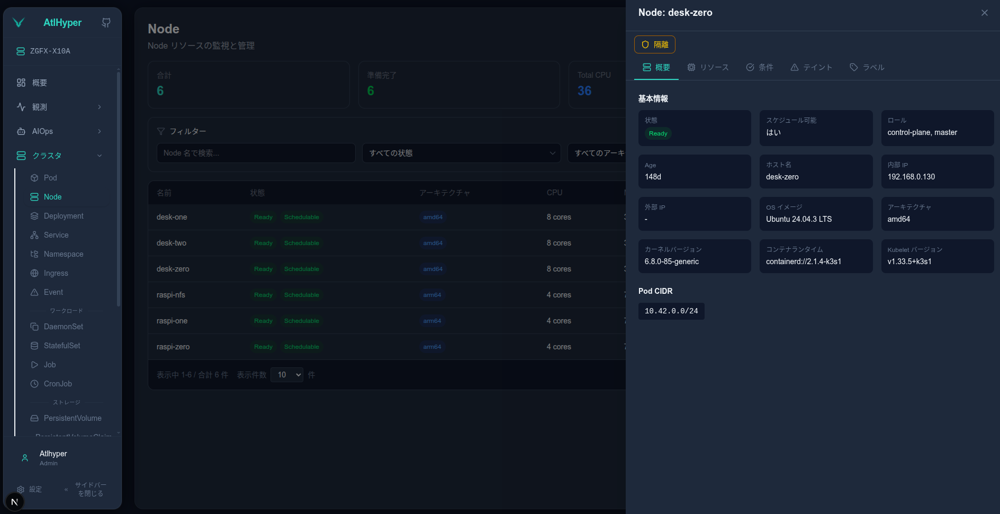
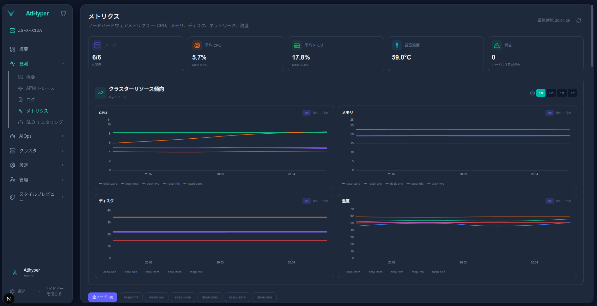
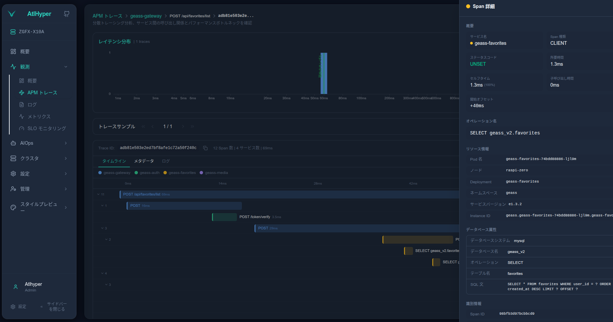
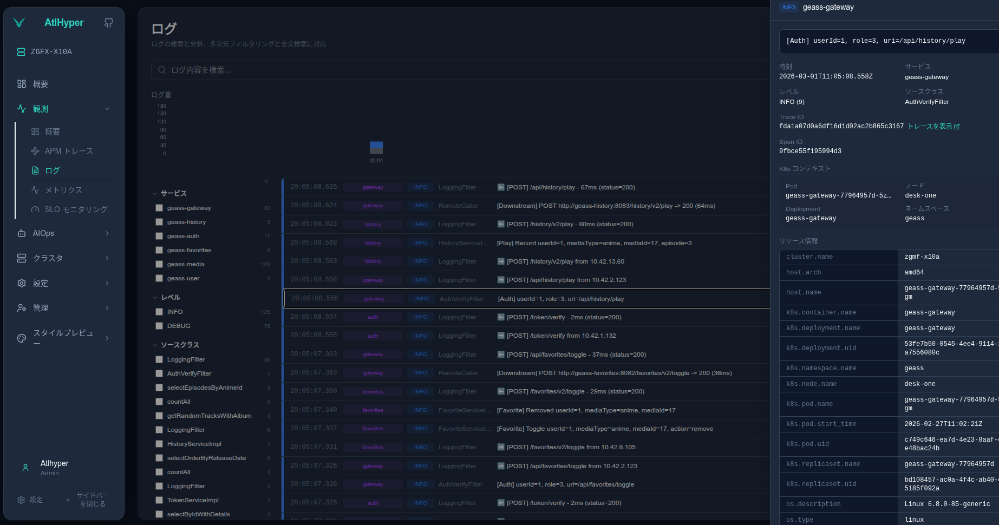
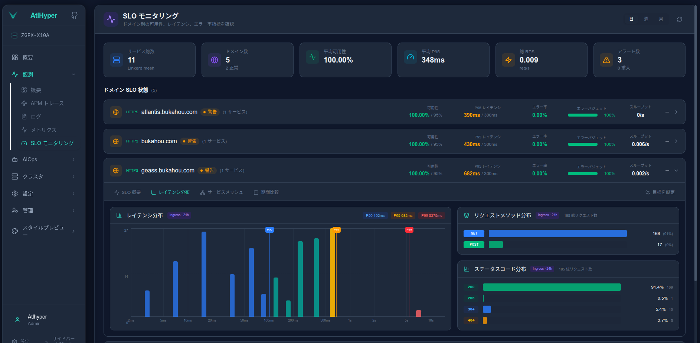
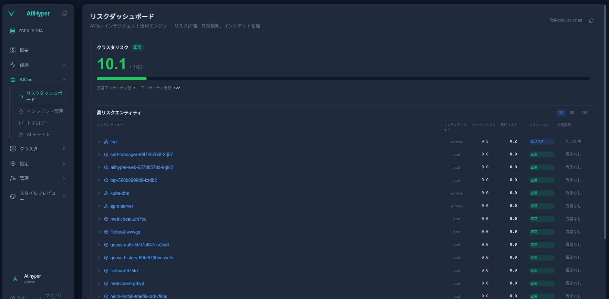
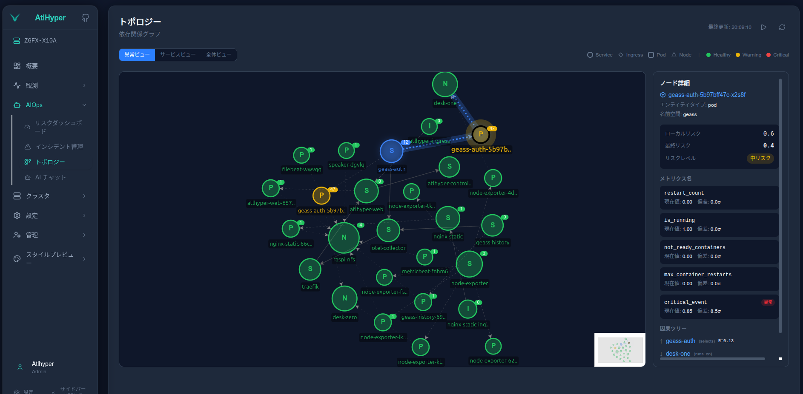
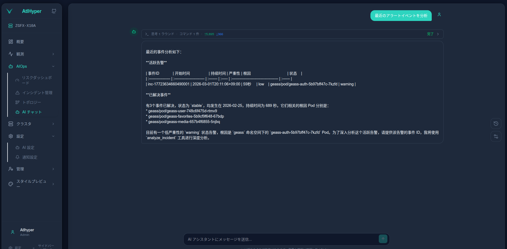

# AtlHyper

**Next-Generation Kubernetes SRE Platform for the AI Era**

English | [中文](docs/static/readme/README_zh.md) | [日本語](docs/static/readme/README_ja.md)

---

AtlHyper is a next-generation SRE platform for the AI era, adopting a Master-Agent architecture to manage multi-cluster Kubernetes environments. It provides full-stack observability across four signal domains (Metrics / APM / Logs / SLO), an algorithm-driven AIOps engine, and AI-assisted operations, with the goal of building a "system runtime cognitive model" that lets systems understand themselves.

---

## Features

- **Multi-Cluster Management** — Manage multiple Kubernetes clusters from a single dashboard with automatic Agent registration
- **Real-Time Monitoring** — Live status and metrics visualization for 21 K8s resource types including Pod, Node, Deployment, etc.
- **Four-Signal Observability** — Full-stack Metrics / APM / Logs / SLO observability based on ClickHouse + OTel Collector
- **Distributed Tracing (APM)** — Trace waterfall, Span details, service topology, latency distribution, database call analysis
- **Log Query** — Multi-dimensional filtering (service/level/source class), timeline histogram, structured log details, Trace correlation
- **SLO Monitoring** — Dual-layer SLO tracking for Ingress (Traefik) + service mesh (Linkerd): latency distribution, error budget, status code distribution
- **AIOps Engine** — Dependency graph construction, EMA dynamic baseline, 3-stage risk scoring, state machine, incident lifecycle management
- **Causal Topology Graph** — Four-layer directed acyclic graph (Ingress -> Service -> Pod -> Node) with risk propagation visualization
- **AI Assistant** — Multi-model natural language operations (Chat + Tool Use), supports Gemini / OpenAI / Claude, incident summary and root cause analysis
- **Alert Notifications** — Email (SMTP) and Slack (Webhook) integrations
- **Remote Operations** — Execute kubectl commands, restart Pods, scale deployments, cordon/uncordon Nodes remotely
- **Audit Logging** — Complete operation history with user tracking
- **Multi-Language** — Chinese, Japanese

---

## Tech Stack

| Component | Technology | Description |
|-----------|------------|-------------|
| **Master** | Go 1.24 + net/http + SQLite | Central control, data aggregation, API server, AIOps engine |
| **Agent** | Go 1.24 + client-go + ClickHouse | Cluster data collection, OTel data query, command execution |
| **Web** | Next.js 16 + React 19 + Tailwind CSS 4 + ECharts + G6 | Visual management interface |
| **Observability** | ClickHouse + OTel Collector + Linkerd | Time-series storage, telemetry collection, service mesh |
| **AI** | Gemini / OpenAI / Claude (Chat + Tool Use) | AI conversational operations, incident analysis |

---

## Architecture

```
┌──────────────────────────────────────────────────────────────────────────────────┐
│                              AtlHyper Platform                                    │
├──────────────────────────────────────────────────────────────────────────────────┤
│                                                                                  │
│  ┌──────────┐    ┌──────────────────────────────────────────────────────────┐    │
│  │  Web UI  │───▶│                        Master                           │    │
│  │(Next.js) │◀───│                                                          │    │
│  └──────────┘    │  ┌─────────┐ ┌────────┐ ┌─────────┐ ┌────────────────┐  │    │
│                  │  │ Gateway │ │DataHub │ │ Service │ │   Database     │  │    │
│                  │  │  (API)  │ │(Memory)│ │(Business│ │   (SQLite)     │  │    │
│                  │  └─────────┘ └────────┘ │ Logic)  │ └────────────────┘  │    │
│                  │  ┌──────────────────┐   └─────────┘                     │    │
│                  │  │  AIOps Engine    │   ┌──────────────────────────┐     │    │
│                  │  │ Graph│Baseline│  │   │      AI (Multi-LLM)     │     │    │
│                  │  │ Risk │State   │  │   │  Chat│Tool Use│Analysis │     │    │
│                  │  │ Machine│Store  │  │   └──────────────────────────┘     │    │
│                  │  └──────────────────┘                                    │    │
│                  └──────────────────────────────────────────────────────────┘    │
│                                          │                                       │
│         ┌────────────────────────────────┼────────────────────────────────┐      │
│         │                                │                                │      │
│         ▼                                ▼                                ▼      │
│  ┌──────────────────┐         ┌──────────────────┐         ┌──────────────────┐  │
│  │  Agent (Cluster A)│        │  Agent (Cluster B)│        │  Agent (Cluster N)│ │
│  │                  │         │                  │         │                  │  │
│  │ SDK (K8s+CH)     │         │ SDK (K8s+CH)     │         │ SDK (K8s+CH)     │  │
│  │ Repository       │         │ Repository       │         │ Repository       │  │
│  │ Concentrator     │         │ Concentrator     │         │ Concentrator     │  │
│  │ Service          │         │ Service          │         │ Service          │  │
│  │ Scheduler        │         │ Scheduler        │         │ Scheduler        │  │
│  └────────┬─────────┘         └────────┬─────────┘         └────────┬─────────┘  │
│           │                            │                            │            │
│           ▼                            ▼                            ▼            │
│  ┌──────────────────┐         ┌──────────────────┐         ┌──────────────────┐  │
│  │ Kubernetes Cluster│        │ Kubernetes Cluster│        │ Kubernetes Cluster│ │
│  │                  │         │                  │         │                  │  │
│  │ ┌──────────────┐ │         │ ┌──────────────┐ │         │ ┌──────────────┐ │  │
│  │ │OTel Collector│ │         │ │OTel Collector│ │         │ │OTel Collector│ │  │
│  │ │node_exporter │ │         │ │node_exporter │ │         │ │node_exporter │ │  │
│  │ │   Linkerd    │ │         │ │   Linkerd    │ │         │ │   Linkerd    │ │  │
│  │ │  ClickHouse  │ │         │ │  ClickHouse  │ │         │ │  ClickHouse  │ │  │
│  │ └──────────────┘ │         │ └──────────────┘ │         │ └──────────────┘ │  │
│  └──────────────────┘         └──────────────────┘         └──────────────────┘  │
└──────────────────────────────────────────────────────────────────────────────────┘
```

---

## Screenshots

### Cluster Overview
Cluster health status, workload summary, SLO overview, node resource usage, recent alerts.



### Pod Management
Cross-namespace Pod list with filtering. Side drawer displays Pod details (basic info, containers, volume mounts, networking, scheduling).



### Node Management
Node list with detail drawer showing system info, roles, Pod CIDR, container runtime version. Supports cordon/uncordon operations.



### Node Metrics
Cluster-wide node-level hardware metrics: CPU, memory, disk, temperature. Supports multiple time ranges (1h/6h/1d/7d) and granularities (1m/5m/15m).



### APM Distributed Tracing
Distributed trace analysis: latency distribution histogram, trace waterfall, Span details (with database attributes and K8s context). Supports Trace-Log correlation.



### Log Query
Multi-dimensional log filtering (service/level/source class), timeline histogram, structured log details (with Trace ID and K8s resource info). Supports full-text search.



### SLO Monitoring
Domain-level SLO overview (availability, P95 latency, error rate, error budget), latency distribution histogram, request method distribution, status code distribution.



### AIOps Risk Dashboard
Cluster risk score (0-100), high-risk entity list showing local risk / final risk / risk level and first anomaly time.



### AIOps Causal Topology
Four-layer dependency graph (Node -> Pod -> Service -> Ingress) with risk propagation visualization. Node detail panel shows baseline metrics and causal chains.



### AI Assistant
Multi-model natural language operations chat (supports Gemini / OpenAI / Claude) with Tool Use (incident query, analysis). Automatically outputs structured incident summaries and root cause analysis.



---

## Data Flow

### Agent -> Master (Snapshot Reporting + Command Execution)

```
[Snapshot Stream]
K8s SDK ──▶ Repository ──▶ SnapshotService ──▶ Scheduler ──▶ Master
• K8s Resources: Pod, Node, Deployment, Service, Ingress, and 21 resource types total
• OTel Data: ClickHouse queries across Metrics / APM / Logs / SLO signal domains
• Time-Series Aggregation: Concentrator ring buffer (1 hour x 1 minute granularity)

[Command Stream]
Master ──▶ Agent Poll ──▶ CommandService ──▶ K8s SDK ──▶ Result → Master

[Heartbeat Stream]
Agent ──▶ Periodic Heartbeat ──▶ Master (connection state maintenance)
```

### Observability Pipeline (OTel -> ClickHouse -> Agent)

```
[Node Metrics]  node_exporter ──▶ OTel Collector ──▶ ClickHouse
[Ingress]       Traefik ──▶ OTel Collector ──▶ ClickHouse
[Mesh]          Linkerd Proxy ──▶ OTel Collector ──▶ ClickHouse
[Traces]        App SDK ──▶ OTel Collector ──▶ ClickHouse
[Logs]          App Logs ──▶ Filebeat ──▶ OTel Collector ──▶ ClickHouse

                    ClickHouse ◀── Agent periodic queries
```

---

## Deployment

### Prerequisites

- Go 1.24+
- Node.js 20+
- Kubernetes cluster(s) for Agent deployment
- ClickHouse (observability data storage)

### Quick Start (Development)

**1. Start Master**
```bash
export MASTER_ADMIN_USERNAME=admin
export MASTER_ADMIN_PASSWORD=$(openssl rand -base64 16)
export MASTER_JWT_SECRET=$(openssl rand -base64 32)

cd cmd/atlhyper_master_v2
go run main.go
# Gateway: :8080, AgentSDK: :8081
```

**2. Start Agent (in K8s cluster)**
```bash
# Cluster ID auto-detected (kube-system UID), or specify via environment variable
export AGENT_MASTER_URL=http://<MASTER_IP>:8081
# export AGENT_CLUSTER_ID=my-cluster  # Optional, auto-detected by default

cd cmd/atlhyper_agent_v2
go run main.go
```

**3. Start Web**
```bash
cd atlhyper_web
npm install && npm run dev
# Access: http://localhost:3000
```

### Configuration Reference

#### Master Environment Variables

| Variable | Required | Default | Description |
|----------|----------|---------|-------------|
| `MASTER_ADMIN_USERNAME` | Yes | - | Admin username |
| `MASTER_ADMIN_PASSWORD` | Yes | - | Admin password |
| `MASTER_JWT_SECRET` | Yes | - | JWT signing key |
| `MASTER_GATEWAY_PORT` | No | `8080` | Web/API port |
| `MASTER_AGENTSDK_PORT` | No | `8081` | Agent data port |
| `MASTER_LOG_LEVEL` | No | `info` | Log level |

#### Agent Environment Variables

| Variable | Required | Default | Description |
|----------|----------|---------|-------------|
| `AGENT_MASTER_URL` | Yes | - | Master AgentSDK URL |
| `AGENT_CLUSTER_ID` | No | Auto-detected | Unique cluster identifier (defaults to kube-system UID) |
| `AGENT_CLICKHOUSE_DSN` | No | - | ClickHouse connection URL (enables OTel queries) |

---

## Project Structure

```
atlhyper/
├── atlhyper_master_v2/     # Master (Central Control) — 37k lines
│   ├── gateway/            #   HTTP API Gateway
│   │   └── handler/        #     Handlers (k8s/observe/aiops/admin/slo subdirectories)
│   ├── service/            #   Business Logic (query + operations)
│   ├── datahub/            #   In-Memory Data Store
│   ├── database/           #   Persistent Storage (SQLite)
│   ├── processor/          #   Data Processing
│   ├── agentsdk/           #   Agent Communication Layer
│   ├── mq/                 #   Message Queue
│   ├── aiops/              #   AIOps Engine
│   ├── ai/                 #   AI Assistant (Gemini/OpenAI/Claude)
│   ├── slo/                #   SLO Route Updater
│   ├── notifier/           #   Alert Notifications
│   └── config/             #   Configuration
│
├── atlhyper_agent_v2/      # Agent (Cluster Proxy) — 20k lines
│   ├── sdk/                #   K8s + ClickHouse SDK
│   ├── repository/         #   Data Repository (K8s + CH queries)
│   ├── service/            #   Snapshot / Command Services
│   ├── concentrator/       #   OTel Time-Series Aggregation (Ring Buffer)
│   ├── scheduler/          #   Scheduler
│   └── gateway/            #   Agent ↔ Master Communication
│
├── atlhyper_web/           # Web Frontend — 58k lines
│   ├── src/app/            #   Next.js Pages
│   ├── src/components/     #   React Components
│   ├── src/api/            #   API Client
│   ├── src/datasource/     #   Data Source Layer (API + mock fallback)
│   └── src/i18n/           #   Internationalization (Chinese/Japanese)
│
├── model_v3/               # Shared Models (cluster/agent/metrics/slo/command/apm/log)
├── common/                 # Utility Packages (logger/crypto/gzip)
├── cmd/                    # Entry Points
└── docs/                   # Documentation
```

---

## AIOps Engine

An algorithm-driven AIOps engine implementing automated anomaly detection, root cause localization, and incident lifecycle management. Core design principle: **Explainable algorithms** — every risk score traces back to specific formulas and input metrics, not an ML black box.

### M1 — Dependency Graph (Correlator)

Automatically builds a four-layer directed acyclic graph (DAG) from `ClusterSnapshot`:

```
Ingress ──routes_to──▶ Service ──selects──▶ Pod ──runs_on──▶ Node
                         │
                         └──calls──▶ Service (Linkerd inter-service traffic)
```

- **Data Sources**: K8s API (resource relationships) + Linkerd outbound (service-to-service calls) + OTel Traces (trace links)
- **Graph Structure**: Forward/reverse adjacency lists supporting BFS link tracing
- **Persistence**: Async write to SQLite after each snapshot

### M2 — Baseline Engine (Baseline)

**EMA (Exponential Moving Average) + 3-sigma dynamic baseline**, dual-channel anomaly detection:

**Channel A — Statistical Detection:**

```
EMA_t = alpha x x_t + (1-alpha) x EMA_{t-1}     (alpha = 0.033, equivalent to 60-sample window)
Anomaly Score = sigmoid(|x - EMA| / sigma - 3)   (deviation > 3-sigma = anomaly)
```

| Entity | Monitored Metrics |
|--------|-------------------|
| Node | cpu_usage, memory_usage, disk_usage, psi_cpu/memory/io |
| Pod | restart_count, is_running, not_ready_containers |
| Service (Linkerd) | error_rate, avg_latency, request_rate |
| Ingress (Traefik) | error_rate, avg_latency |

**Channel B — Deterministic Detection (bypasses cold start):**

| Detection | Score |
|-----------|-------|
| OOMKilled | 0.95 |
| CrashLoopBackOff | 0.90 |
| Configuration Error | 0.80 |
| K8s Critical Event (within 5 min) | 0.85 |
| Deployment Unavailable >= 75% | 0.95 |

### M3 — Risk Scoring (Risk Scorer)

Three-stage pipeline from local metrics to global topology:

```
Stage 1 — Local Risk:    R_local = max(R_stat, R_det)
Stage 2 — Temporal Decay: W_time = 0.7 + 0.3 x (1 - exp(-dt / tau))
Stage 3 — Graph Propagation: R_final = f(R_weighted, avg(R_final(deps)), SLO_context)
```

| R_final | Level |
|---------|-------|
| >= 0.8 | Critical |
| >= 0.6 | High |
| >= 0.4 | Medium |
| >= 0.2 | Low |
| < 0.2 | Healthy |

### M4 — State Machine (State Machine)

```
                    R>0.2 sustained >=2min        R>0.5 sustained >=5min
  Healthy ──────────────────▶ Warning ──────────────────▶ Incident
     ^  R<0.15 sustained >=5min  │                            │
     └───────────────────────────┘          R<0.15 sustained >=10min
                                                              │
                                                              ▼
                               R>0.2 immediate relapse     Recovery
                    Warning ◀──────────────────────────────── │
                                                              │
                                           Scheduled check (10min)
                                              Stable ◀────────┘
```

### M5 — Incident Store (Incident Store)

SQLite-persisted structured incident records:

| Data | Content |
|------|---------|
| **Incident** | ID, cluster, status, severity, root cause entity, peak risk, duration |
| **Entity** | Affected entity list (with R_local / R_final / role) |
| **Timeline** | State transition timeline |
| **Statistics** | MTTR, recurrence rate, severity distribution, Top root causes |

AI Enhancement (optional): LLM (Gemini / OpenAI / Claude) generates incident summaries, root cause analysis, and remediation recommendations.

---

## Security

- **Never hardcode** API keys, passwords, or secrets in code
- All credentials use environment variables
- AI API keys are stored encrypted in database (configured via Web UI)
- K8s Secret contents are masked in display

---

## License

MIT

---

## Links

- [GitHub Repository](https://github.com/bukahou/atlhyper)
