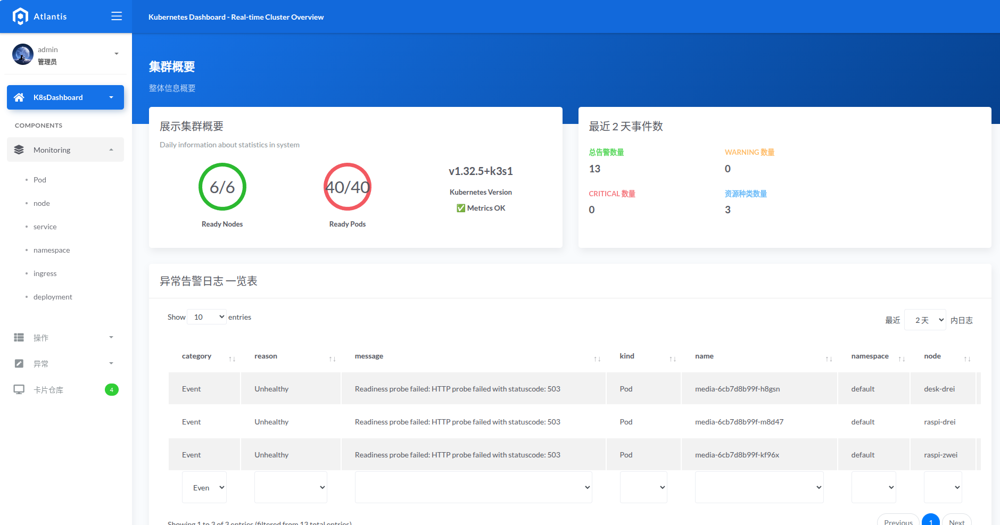

# 🧠 NeuroController · 插件化 Kubernetes 异常检测与告警控制器

## 📌 项目概述

**NeuroController** 是一个轻量级、可运行于边缘设备（如树莓派）的 Kubernetes 异常检测与调控平台。它设计用于补足传统 APM 和 Prometheus 在异常响应上的盲区，具备“事件驱动、插件化、可视化、可自愈”的能力，适用于私有云/边缘云等多场景环境。

项目地址：[https://github.com/bukahou/kubeWatcherPlugin](https://github.com/bukahou/kubeWatcherPlugin)
Docker 镜像：[bukahou/neurocontroller](https://hub.docker.com/r/bukahou/neurocontroller)

---

## 🏗️ 系统架构模块

### 1. **Watcher 插件系统**

- 对 Pod、Deployment、Node、Endpoint、Event 等资源进行实时监控
- 支持插件式注册与控制器生命周期管理
- 内置异常检测与标准化事件生成

### 2. **Diagnosis 引擎**

- 对收集到的事件进行聚合、去重、等级评估
- 维护事件池与“新事件判定”机制，避免重复告警

### 3. **Alert Dispatcher 告警分发**

- 支持 Slack、Email、Webhook 多通道异步分发
- 配有节流机制、防重复发送、优先级区分（轻量/重度）

### 4. **UI API Server（前后端分离）**

- 提供 RESTful API 支持前端数据展示与交互
- 支持资源列表、异常日志、事件概览、命名空间/节点视图等接口
- 支持登录认证、权限控制、用户管理、部署调控（副本数/镜像）

### 5. **Agent 主从架构（实验中）**

- 控制器作为中心节点发起调度
- Agent 独立运行于每个节点，支持状态上报、子集群采集、远程指令响应

### 6. **SQLite 数据持久层**

- 所有异常事件与用户数据本地持久化
- 多模块共用统一 `db/models` 模型结构，提升复用性与维护性

---

## 🖼️ UI 展示示例 Screenshots

### 🧭 集群总览 Dashboard

展示节点、Pod 状态、K8s 版本、告警概览。


### 📦 Deployment 一览

显示各命名空间中 Deployment 数量与副本状态。


### 📁 命名空间视图 Namespace View

展示所有命名空间的资源信息。


### 🔍 Pod 概览 Pod Summary

按命名空间展示 Pod 列表。


### 🧪 Pod 详情 Pod Describe

状态 + Service + 容器配置汇总。


### 📄 Pod 日志与事件 Logs + Events

事件与 stdout 日志聚合视图。


### 🔌 服务视图 Service View

展示所有 ClusterIP/NodePort 类型服务。


### 💬 Slack 告知例 / Slack Alert Example

以下为 Slack BlockKit 式的轻量告警通知：


### 📧 邮件通知例 / Email Alert Template

系统异常时发送的 HTML 邮件通知样式：


### 👥 用户管理界面 / User Management

展示用户角色权限管理与修改界面：


---

## ⚙️ 部署方式

以下是完整部署所需的 Kubernetes 资源清单，包括主控制器、Agent、服务暴露和配置：

---

### 🔐 1. NeuroAgent 权限 - ClusterRoleBinding（最大权限）

```yaml
apiVersion: rbac.authorization.k8s.io/v1
kind: ClusterRoleBinding
metadata:
  name: neuroagent-cluster-admin
subjects:
  - kind: ServiceAccount
    name: default
    namespace: neuro
roleRef:
  kind: ClusterRole
  name: cluster-admin
  apiGroup: rbac.authorization.k8s.io
```

---

### 🚀 2. NeuroAgent Deployment

```yaml
apiVersion: apps/v1
kind: Deployment
metadata:
  name: neuroagent
  namespace: neuro
  labels:
    app: neuroagent
spec:
  replicas: 2 # 可根据节点数量调整
  selector:
    matchLabels:
      app: neuroagent
  template:
    metadata:
      labels:
        app: neuroagent
    spec:
      serviceAccountName: default
      containers:
        - name: neuroagent
          image: bukahou/neuroagent:v1.0.1
          imagePullPolicy: Always
          ports:
            - containerPort: 8082
          resources:
            requests:
              memory: "64Mi"
              cpu: "50m"
            limits:
              memory: "128Mi"
              cpu: "100m"
          envFrom:
            - configMapRef:
                name: neuro-config
```

---

### 🌐 3. NeuroAgent ClusterIP Service（供中心访问）

```yaml
apiVersion: v1
kind: Service
metadata:
  name: neuroagent-service
  namespace: neuro
spec:
  selector:
    app: neuroagent
  type: ClusterIP
  ports:
    - name: agent-api
      protocol: TCP
      port: 8082
      targetPort: 8082
```

---

### 🎯 4. NeuroController Deployment（主控制器）

```yaml
apiVersion: apps/v1
kind: Deployment
metadata:
  name: neurocontroller
  namespace: neuro
  labels:
    app: neurocontroller
spec:
  replicas: 1
  selector:
    matchLabels:
      app: neurocontroller
  template:
    metadata:
      labels:
        app: neurocontroller
    spec:
      nodeSelector:
        kubernetes.io/hostname: desk-eins
      tolerations:
        - key: "node-role.kubernetes.io/control-plane"
          operator: "Exists"
          effect: "NoSchedule"
        - key: "node-role.kubernetes.io/master"
          operator: "Exists"
          effect: "NoSchedule"
      containers:
        - name: neurocontroller
          image: bukahou/neurocontroller:v2.0.1
          imagePullPolicy: Always
          ports:
            - containerPort: 8081 # 📌 控制面板 UI 服务监听端口
          resources:
            requests:
              memory: "128Mi"
              cpu: "100m"
            limits:
              memory: "256Mi"
              cpu: "200m"
          envFrom:
            - configMapRef:
                name: neuro-config
```

---

### 🌐 5. NeuroController NodePort Service

```yaml
apiVersion: v1
kind: Service
metadata:
  name: neurocontroller-nodeport
  namespace: neuro
spec:
  selector:
    app: neurocontroller
  type: NodePort
  ports:
    - name: ui
      port: 8081 # Service 内部端口
      targetPort: 8081 # 容器内监听端口
      nodePort: 30080 # Node 上暴露给外部的端口
```

---

### 🧾 6. ConfigMap 配置项（共用）

```yaml
apiVersion: v1
kind: ConfigMap
metadata:
  name: neuro-config
  namespace: neuro
data:
  # === 🛰️ Agent 访问配置 ===
  AGENT_ENDPOINTS: "http://neuroagent-service.neuro.svc.cluster.local:8082"

  # === 📧 邮件配置 ===
  MAIL_USERNAME: "xxxxxxxx@gmail.com"
  MAIL_PASSWORD: "xxxxxxxx"
  MAIL_FROM: "xxxxxxxx@gmail.com"
  MAIL_TO: "xxxxxxxx@gmail.com"

  # Slack Webhook 地址
  SLACK_WEBHOOK_URL: "https://hooks.slack.com/xxxxxxxxxxxxxxxxx"

  # 启用控制项（true/false）
  ENABLE_EMAIL_ALERT: "false"
  ENABLE_SLACK_ALERT: "false"
  ENABLE_WEBHOOK_SERVER: "true"
```

---

- 支持 Kubernetes 原生部署（Deployment + Service）
- 内置健康检查探针、日志链路自动注入（traceID）
- 支持通过 GitHub Actions + Webhook 实现自动镜像构建与灰度发布
- 可配置性高：通过 ConfigMap 管理告警策略、通道开关、邮件配置等

---

## 📈 项目亮点

- 🚨 **插件化异常监控**：可灵活扩展监控对象与诊断逻辑
- 🧠 **智能事件判重与告警节流**：有效减少重复通知
- 📊 **可视化 UI 支持集群资源观察与操作**
- 🛰 **轻量级，适配低资源设备**：Raspberry Pi 上稳定运行
- 🔗 **支持 traceID 与系统级 syscall trace 结合**：实现黑盒组件可观测（实验性）

---

## 🧪 使用场景

- 私有云 / 边缘云 / 本地集群的异常响应与快速可视化
- 对 Prometheus 等指标系统不敏感的事件级问题的补足
- 多节点协同管理的 Agent 式监控与状态聚合
- 教学演示、Kubernetes 可观测性增强实验平台
