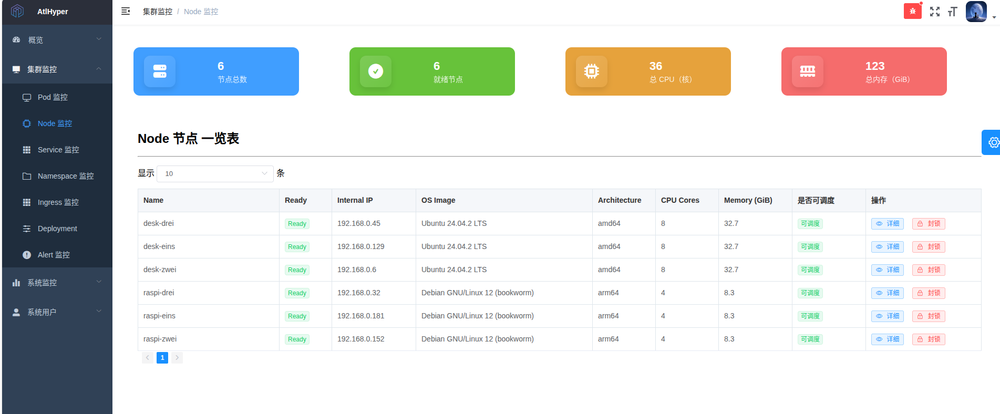
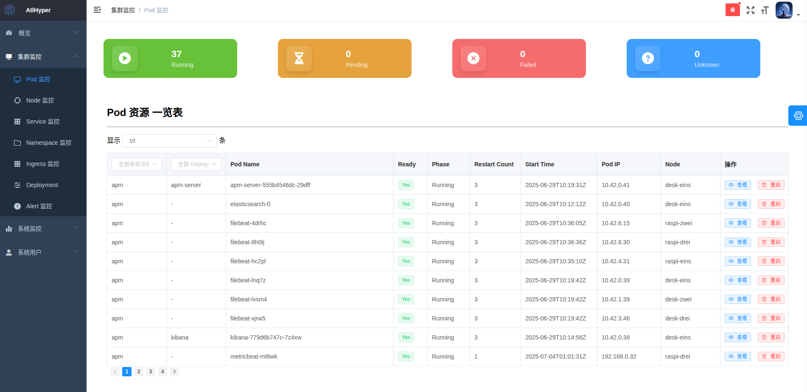

# AtlHyper

> 🌐 [English](README.md) | [简体中文](README.zh-CN.md) | [日本語](README.ja.md)

## 🧠 Project Name: AtlHyper

### 📌 Project Positioning

**AtlHyper** is a lightweight Kubernetes cluster observability and control platform. It focuses on real-time monitoring, anomaly alerting, issue diagnosis, and resource operations for core resources such as Nodes, Pods, and Deployments. Built with a frontend-backend decoupled architecture, it is ideal for small to medium-sized cluster administrators in scenarios like local deployment, edge cluster management, or R\&D environment monitoring.

The project adopts a **MarstAgent model**, where Agents are deployed within each Kubernetes cluster to collect data and perform operations, while the control center (Marst) is recommended to be deployed externally using Docker Compose. Communication between Marst and Agents is done via HTTP, enabling centralized control and multi-cluster support.

---

### 🚀 Core Features

| Module           | Description                                                                    |
| ---------------- | ------------------------------------------------------------------------------ |
| Cluster Overview | Real-time stats and list views for key resources: Nodes, Pods, Services, etc.  |
| Alerting System  | Event-based anomaly detection, de-duplication, and alerting via Slack/email    |
| Resource Details | Detailed inspection of Pod, Deployment, Namespace (status, spec, events, etc.) |
| Resource Actions | UI-triggered operations: Pod restart, node cordon/drain, resource deletion     |
| Advanced Filters | Field-based filtering by namespace, status, node, reason, and time/keywords    |
| Audit Logs       | Backend tracks all operations and displays them in a log panel                 |
| Configuration UI | Web interface for managing alert configs (email, Slack, Webhook, etc.)         |

---

### 🧱 Technical Architecture

#### 🔧 Backend (Golang)

- Built on Gin framework with RESTful APIs
- Uses controller-runtime/client-go to access Kubernetes API
- Modular anomaly detection engine with thresholds, throttling, and formatting
- Embedded SQLite database for storing logs and alerts
- Supports running inside Kubernetes or externally with Docker Compose

#### 🖼️ Frontend (Vue2 + Element UI)

- Rebuilt from static HTML to a Vue SPA
- Modular component design (InfoCard, DataTable, EventTable, etc.)
- Supports pagination, dropdown filters, time range filtering, keyword search
- Uses CountUp and ECharts for visual display and metrics

---

### 📸 Feature Overview

#### 🧩 1. Cluster Resource Overview

Real-time status display of resources such as Node, Pod, Deployment, and Service:





---

#### 🚨 2. Anomaly Alerting System

Supports multi-channel alerting via Slack / Mail with event classification and throttling:


---

#### 🔍 3. Resource Detail Pages

Resources like Pod / Node / Deployment / Namespace support detailed inspection:


---

#### 🗂️ 4. Configuration Management Interface

Allows viewing the contents of a ConfigMap by specifying the Namespace.


---

### 🧰 Core Dependencies

| Component                      | Description                                       |
| ------------------------------ | ------------------------------------------------- |
| client-go / controller-runtime | Kubernetes API access                             |
| Gin + zap                      | Backend API and structured logging                |
| SQLite                         | Lightweight embedded database                     |
| Element UI + Vue Router        | UI component library and routing                  |
| GitHub Actions + Docker Hub    | CI/CD for image build and push                    |
| Nginx                          | Public deployment reverse proxy and static assets |

---

### 📦 Deployment Options

#### ✅ Kubernetes Cluster Deployment (Agent)

```yaml
# 0. Create namespace if not exists
apiVersion: v1
kind: Namespace
metadata:
  name: atlhyper
---
# 1. Grant ClusterRoleBinding to Agent
apiVersion: rbac.authorization.k8s.io/v1
kind: ClusterRoleBinding
metadata:
  name: atlhyper-agent-cluster-admin
subjects:
  - kind: ServiceAccount
    name: default
    namespace: atlhyper
roleRef:
  kind: ClusterRole
  name: cluster-admin
  apiGroup: rbac.authorization.k8s.io
---
# 2. Agent Deployment
apiVersion: apps/v1
kind: Deployment
metadata:
  name: atlhyper-agent
  namespace: atlhyper
spec:
  replicas: 2
  selector:
    matchLabels:
      app: atlhyper-agent
  template:
    metadata:
      labels:
        app: atlhyper-agent
    spec:
      serviceAccountName: default
      containers:
        - name: atlhyper-agent
          image: bukahou/atlhyper-agent:v1.0.1
          imagePullPolicy: Always
          ports:
            - containerPort: 8082
          resources:
            requests:
              memory: "64Mi"
              cpu: "50m"
            limits:
              memory: "128Mi"
              cpu: "100m"
---
# 3. Agent Service
apiVersion: v1
kind: Service
metadata:
  name: atlhyper-agent-service
  namespace: atlhyper
spec:
  selector:
    app: atlhyper-agent
  type: ClusterIP
  ports:
    - name: agent-api
      protocol: TCP
      port: 8082
      targetPort: 8082
```

#### ✅ Docker Compose Deployment (Marst Controller)

```yaml
services:
  atlhyper:
    image: bukahou/atlhyper-controller:v1.0.1
    container_name: atlhyper
    restart: always
    ports:
      - "8081:8081"
    environment:
      # === Agent endpoint(s) ===
      - AGENT_ENDPOINTS=https://your-agent-endpoint

      # === Email settings (non-sensitive) ===
      - MAIL_USERNAME=your_mail@example.com
      - MAIL_PASSWORD=your_password
      - MAIL_FROM=your_mail@example.com
      - MAIL_TO=receiver@example.com

      # Feature toggles
      - SLACK_WEBHOOK_URL=https://hooks.slack.com/services/xxxx/xxxx/xxxxx
      - ENABLE_EMAIL_ALERT=false
      - ENABLE_SLACK_ALERT=true
      - ENABLE_WEBHOOK_SERVER=false

      # Admin account (override, optional)
      - DEFAULT_ADMIN_USERNAME=bukahou
      - DEFAULT_ADMIN_PASSWORD=******
      - DEFAULT_ADMIN_DISPLAY_NAME=Atlhyper
      - DEFAULT_ADMIN_EMAIL=admin@atlhyper.com
```

---

### 📂 Project Structure Overview

```
├── cmd/                    # Entry point
├── external/               # HTTP handlers and route registration
├── interfaces/             # API interface layer
├── internal/               # Core logic (query, diagnosis, operator, etc.)
├── db/                     # SQLite database layer
├── config/                 # Configuration and env parsing
├── web/                    # Frontend Vue project
```

---

### 📈 Current Progress (August 2025)

- ✅ Supports Master-Agent model with external controller
- ✅ Full event diagnosis, deduplication, alerting and persistence
- ✅ UI views implemented: Pod, Node, Deployment, Namespace, Service, Ingress
- ✅ Supports field-based filtering, pagination, and detail popups
- 🚧 Ongoing: multi-cluster support, RBAC system, user audit tracking

---

📧 For communication or collaboration, please contact: **[zjh997222844@gmail.com](mailto:zjh997222844@gmail.com)**
