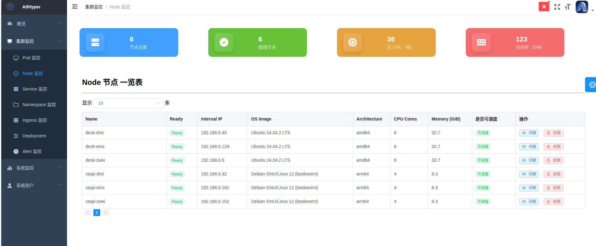
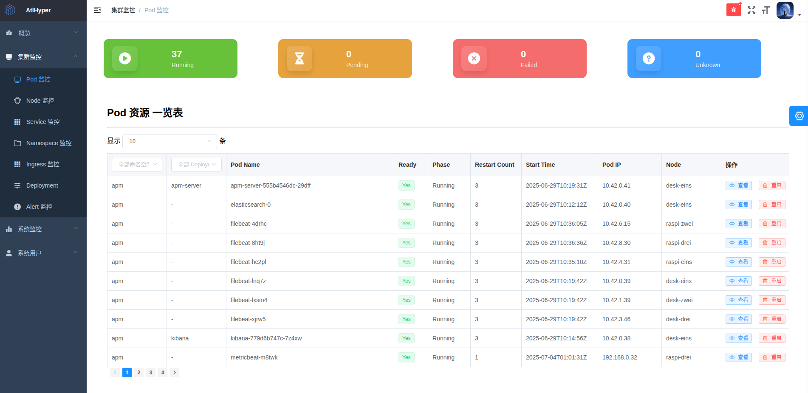
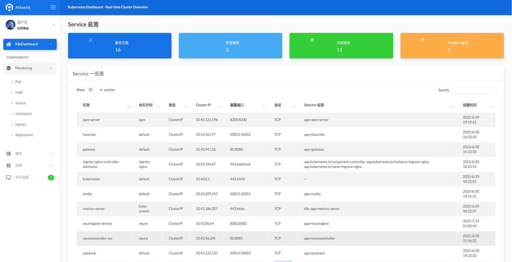
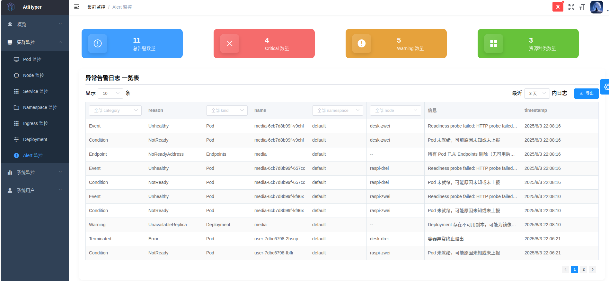
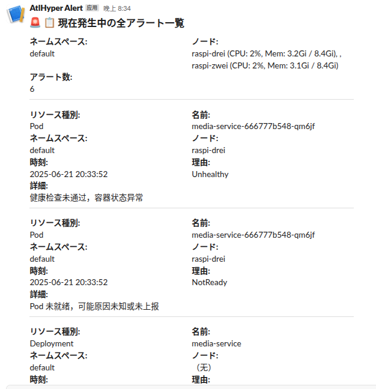
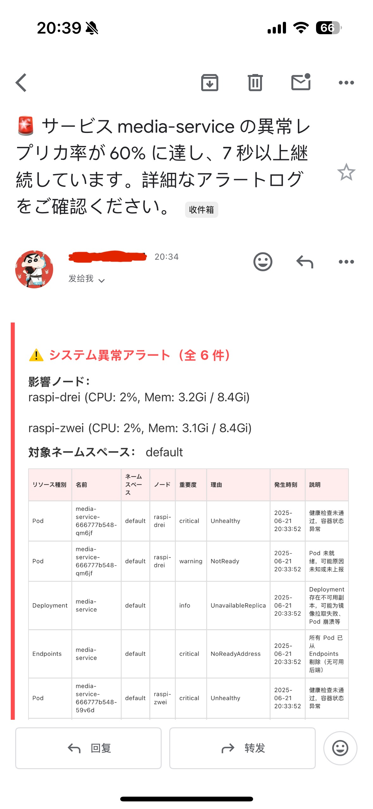
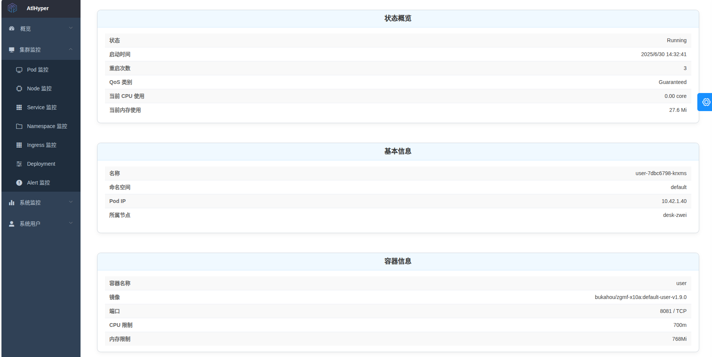
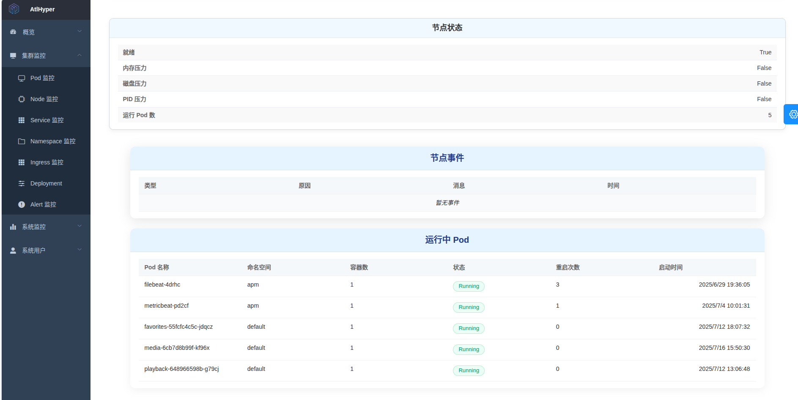
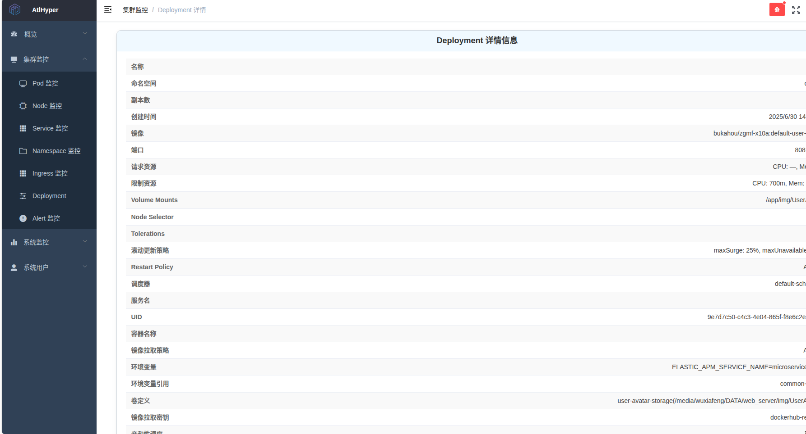
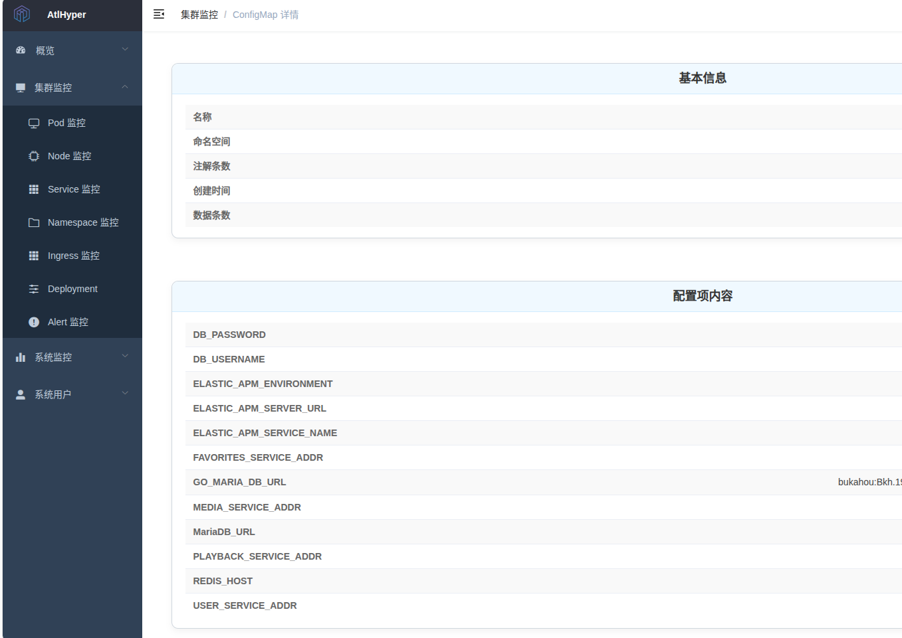

## 🧠 项目名称：AtlHyper

### 📌 项目定位

AtlHyper 是一个轻量级 Kubernetes 集群可观测性与控制平台，聚焦于节点、Pod、Deployment 等资源的实时监控、异常告警、问题分析与集群操作，结合前后端分离架构，适用于中小规模集群管理者进行本地部署、边缘集群控制或研发环境监控。

本项目采用 **MarstAgent 模式**，即：Agent 常驻部署于 Kubernetes 集群中收集数据并执行操作，而主控程序（Marst）推荐部署在集群外部的 Docker Compose 环境中，通过 HTTP 与各个 Agent 通信，实现集中式控制与多集群支持。

---

### 🚀 项目功能

| 模块         | 功能说明                                                                       |
| ------------ | ------------------------------------------------------------------------------ |
| 集群资源概览 | 提供节点、Pod、Service、Deployment 等核心资源的实时数据卡片与列表视图          |
| 异常告警系统 | 支持基于事件的诊断机制，过滤、去重并发送 Slack/邮件告警（含节流机制）          |
| 资源详情页面 | 支持对 Pod、Deployment、Namespace 等的详细信息展示，包括状态、配置、历史事件等 |
| 控制操作支持 | 支持通过 UI 页面执行如 Pod 重启、节点 cordon/drain、资源删除等操作             |
| 多种筛选器   | 所有表格组件支持字段级筛选（命名空间、状态、节点、原因等）与时间/关键词过滤    |
| 集群日志审计 | 后端记录所有操作行为并展示在操作审计页面                                       |
| 配置管理     | 支持 Web 界面配置邮件、Slack、Webhook 等告警发送方式与行为开关                 |

---

### 🧱 技术架构

#### 🔧 后端（Golang）

- 基于 Gin 框架构建 RESTful 接口
- 使用 controller-runtime/client-go 与 Kubernetes API 通信
- 异常告警引擎模块化，包括告警阈值判断、节流器、轻量格式化等
- 内置 SQLite 数据库（用于日志、告警等记录）
- 支持运行在 Kubernetes 内部或外部 Docker Compose 中

#### 🖼️ 前端（Vue2 + Element UI）

- 重构原始 HTML 页面为 Vue 单页应用（SPA）
- 使用组件化结构（InfoCard、DataTable、EventTable 等）
- 支持分页、下拉筛选、时间范围过滤、关键字搜索
- 使用 CountUp、ECharts 实现卡片统计与图表展示

---

### 📸 项目功能示意图

#### 🧩 1. 集群资源概览

实时展示 Node、Pod、Deployment、Service 等资源状态：






---

#### 🚨 2. 异常告警系统

支持 Slack / Mail 多渠道告警，结合事件分类、节流机制：





---

#### 🔍 3. 资源详情页面

资源如 Pod / Node / Deployment / Namespace 支持点击查看详情：





---

#### 🗂️ 4. 配置管理界面

可通过指定命名空间（Namespace）查看对应的 ConfigMap 内容：



---

### 🧰 核心依赖

| 组件                                      | 说明                           |
| ----------------------------------------- | ------------------------------ |
| Kubernetes client-go / controller-runtime | 访问集群 API                   |
| Gin                                       | REST API 服务                  |
| SQLite                                    | 内置轻量数据库                 |
| Element UI + Vue Router                   | 前端组件库与路由控制           |
| GitHub Actions + Docker Hub               | 实现镜像构建与推送，支持 CI/CD |
| Nginx                                     | 公网部署反向代理与静态资源托管 |

---

### 📦 部署方式

#### ✅ Kubernetes 集群部署方式

```yaml
# 0. 创建命名空间 atlhyper（如尚未存在）
apiVersion: v1
kind: Namespace
metadata:
  name: atlhyper
---
# 1. AtlHyper Agent 权限 - ClusterRoleBinding（最大权限）
apiVersion: rbac.authorization.k8s.io/v1
kind: ClusterRoleBinding
metadata:
  name: atlhyper-agent-cluster-admin
subjects:
  - kind: ServiceAccount
    name: default
    namespace: atlhyper
roleRef:
  kind: ClusterRole
  name: cluster-admin
  apiGroup: rbac.authorization.k8s.io
---
# 2. AtlHyper Agent Deployment
apiVersion: apps/v1
kind: Deployment
metadata:
  name: atlhyper-agent
  namespace: atlhyper
  labels:
    app: atlhyper-agent
spec:
  replicas: 2
  selector:
    matchLabels:
      app: atlhyper-agent
  template:
    metadata:
      labels:
        app: atlhyper-agent
    spec:
      serviceAccountName: default
      containers:
        - name: atlhyper-agent
          image: bukahou/atlhyper-agent:v1.0.1
          imagePullPolicy: Always
          ports:
            - containerPort: 8082
          resources:
            requests:
              memory: "64Mi"
              cpu: "50m"
            limits:
              memory: "128Mi"
              cpu: "100m"
---
# 3. AtlHyper Agent ClusterIP Service
apiVersion: v1
kind: Service
metadata:
  name: atlhyper-agent-service
  namespace: atlhyper
spec:
  selector:
    app: atlhyper-agent
  type: ClusterIP
  ports:
    - name: agent-api
      protocol: TCP
      port: 8082
      targetPort: 8082
```

#### ✅ Docker Compose 部署（主控外部部署推荐）

```yaml
services:
  atlhyper:
    image: bukahou/atlhyper-controller:v1.0.1
    container_name: atlhyper
    restart: always
    ports:
      - "8081:8081" # 本机端口:容器端口
    environment:
      # ===  Agent 访问配置 ===
      - AGENT_ENDPOINTS=https://your-agent-endpoint

      # ===  邮件配置（非敏感） ===
      - MAIL_USERNAME=your_mail@example.com
      - MAIL_PASSWORD=your_password
      - MAIL_FROM=your_mail@example.com
      - MAIL_TO=receiver@example.com

      # 控制项（布尔值作为字符串）
      - SLACK_WEBHOOK_URL=https://hooks.slack.com/services/xxxx/xxxx/xxxxx
      - ENABLE_EMAIL_ALERT=false
      - ENABLE_SLACK_ALERT=true
      - ENABLE_WEBHOOK_SERVER=false

      # 管理员默认配置覆盖（建议使用环境变量或配置文件管理）
      - DEFAULT_ADMIN_USERNAME=bukahou
      - DEFAULT_ADMIN_PASSWORD=******
      - DEFAULT_ADMIN_DISPLAY_NAME=Atlhyper
      - DEFAULT_ADMIN_EMAIL=admin@atlhyper.com
```

---

### 📂 项目结构概览

```
├── cmd/                    # 启动主入口
├── external/               # Gin 路由注册与 handler 实现
├── interfaces/             # 接口编排层
├── internal/               # 核心逻辑层（如 query、diagnosis、operator 等）
├── db/                     # SQLite 数据访问层
├── config/                 # 环境变量与配置解析
├── web/                    # 前端 Vue 项目
```

---

### 📈 当前进展（2025 年 8 月）

- ✅ 支持主从模式（Agent 独立部署，主控脱离集群运行）
- ✅ 支持事件诊断、过滤、告警与持久化
- ✅ UI 已完成 Pod、Node、Deployment、Namespace、Service、Ingress 等视图
- ✅ 完成字段筛选、分页、详情页弹窗等交互设计
- 🚧 多集群管理、权限系统、用户审计强化中

---

📧 如需交流或合作，请联系作者：**[zjh997222844@gmail.com](mailto:zjh997222844@gmail.com)**
