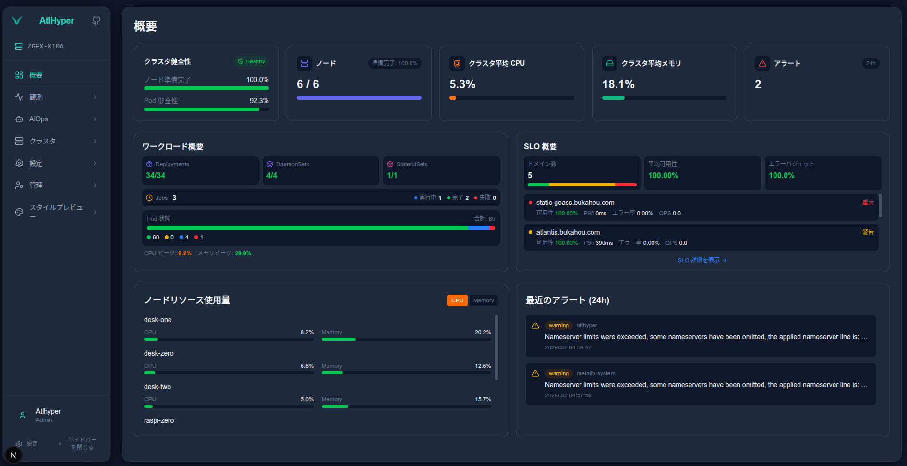
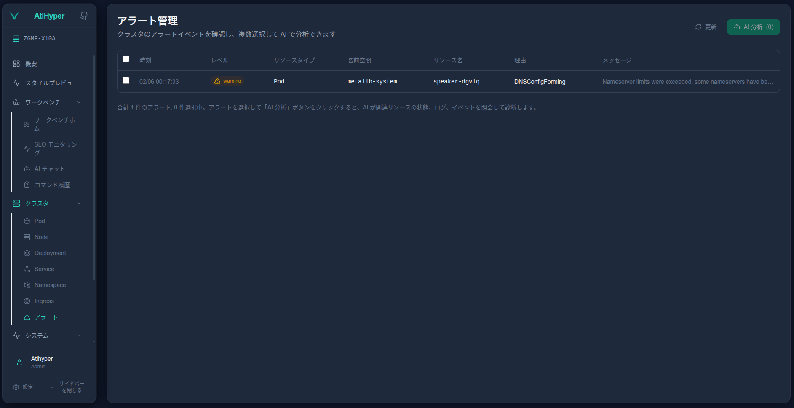

# AtlHyper

**Kubernetes マルチクラスター監視・オブザーバビリティプラットフォーム**

[English](../README.md) | [中文](README_zh.md) | 日本語

---

AtlHyper は Kubernetes 環境向けの監視・オブザーバビリティプラットフォームです。Master-Agent アーキテクチャを採用し、マルチクラスター統合管理、フルスタックオブザーバビリティ（Metrics / Traces / Mesh）、アルゴリズム駆動の AIOps エンジン、AI アシスタント運用をサポートしています。

---

## 機能

- **マルチクラスター管理** — 単一のダッシュボードで複数の Kubernetes クラスターを管理
- **リアルタイム監視** — Pod、Node、Deployment など 21 種類の K8s リソースのステータスとメトリクスを可視化
- **異常検知** — CrashLoopBackOff、OOMKilled、ImagePullBackOff などを自動検知
- **フルスタックオブザーバビリティ** — ClickHouse + OTel Collector + Linkerd による Metrics / Traces / Mesh の統合観測
- **SLO 監視** — Ingress（Traefik）+ サービスメッシュ（Linkerd）の二層 SLO トラッキング、レイテンシ分布・ステータスコード分布を含む
- **サービスメッシュトポロジー** — Linkerd サービス依存関係の可視化（mTLS トラフィック、レイテンシ分布、リクエスト成功率）
- **AIOps エンジン** — 依存グラフ構築、EMA 動的ベースライン、三段階リスクスコアリング、ステートマシン、インシデントライフサイクル管理
- **AI アシスタント** — Gemini 駆動の自然言語運用（Chat + Tool Use）、インシデント要約と根本原因分析
- **アラート通知** — メール (SMTP) と Slack (Webhook) に対応
- **リモート運用** — kubectl コマンドのリモート実行、Pod 再起動、レプリカ数調整
- **監査ログ** — 完全な操作履歴とユーザー追跡
- **多言語対応** — 中国語、日本語

---

## 技術スタック

| コンポーネント | 技術 | 説明 |
|---------------|------|------|
| **Master** | Go 1.24 + net/http + SQLite | 中央制御、データ集約、API サーバー、AIOps エンジン |
| **Agent** | Go 1.24 + client-go + ClickHouse | クラスターデータ収集、OTel データクエリ、コマンド実行 |
| **Web** | Next.js 16 + React 19 + Tailwind CSS 4 + ECharts + G6 | 可視化管理インターフェース |
| **オブザーバビリティ** | ClickHouse + OTel Collector + Linkerd | メトリクスストレージ、テレメトリ収集、サービスメッシュ |
| **AI** | Gemini API (Chat + Tool Use) | AI チャット運用、インシデント分析 |

---

## アーキテクチャ

```
┌──────────────────────────────────────────────────────────────────────────────────┐
│                           AtlHyper プラットフォーム                                │
├──────────────────────────────────────────────────────────────────────────────────┤
│                                                                                  │
│  ┌──────────┐    ┌──────────────────────────────────────────────────────────┐    │
│  │  Web UI  │───▶│                        Master                           │    │
│  │(Next.js) │◀───│                                                          │    │
│  └──────────┘    │  ┌─────────┐ ┌────────┐ ┌─────────┐ ┌────────────────┐  │    │
│                  │  │ Gateway │ │DataHub │ │ Service │ │   Database     │  │    │
│                  │  │  (API)  │ │(メモリ) │ │(業務層) │ │   (SQLite)     │  │    │
│                  │  └─────────┘ └────────┘ └─────────┘ └────────────────┘  │    │
│                  │  ┌──────────────────┐   ┌──────────────────────────┐     │    │
│                  │  │  AIOps Engine    │   │      AI (Gemini)        │     │    │
│                  │  │依存グラフ│基線│ﾘｽｸ│   │  Chat│Tool Use│分析     │     │    │
│                  │  │ｽﾃｰﾄﾏｼﾝ│ｲﾝｼﾃﾞﾝﾄ   │   └──────────────────────────┘     │    │
│                  │  └──────────────────┘                                    │    │
│                  └──────────────────────────────────────────────────────────┘    │
│                                          │                                       │
│         ┌────────────────────────────────┼────────────────────────────────┐      │
│         │                                │                                │      │
│         ▼                                ▼                                ▼      │
│  ┌──────────────────┐         ┌──────────────────┐         ┌──────────────────┐  │
│  │Agent (クラスタA) │         │Agent (クラスタB) │         │Agent (クラスタN) │  │
│  │                  │         │                  │         │                  │  │
│  │ SDK (K8s+CH)     │         │ SDK (K8s+CH)     │         │ SDK (K8s+CH)     │  │
│  │ Repository       │         │ Repository       │         │ Repository       │  │
│  │ Concentrator     │         │ Concentrator     │         │ Concentrator     │  │
│  │ Service          │         │ Service          │         │ Service          │  │
│  │ Scheduler        │         │ Scheduler        │         │ Scheduler        │  │
│  └────────┬─────────┘         └────────┬─────────┘         └────────┬─────────┘  │
│           │                            │                            │            │
│           ▼                            ▼                            ▼            │
│  ┌──────────────────┐         ┌──────────────────┐         ┌──────────────────┐  │
│  │ Kubernetes クラスタ│         │ Kubernetes クラスタ│         │ Kubernetes クラスタ│  │
│  │                  │         │                  │         │                  │  │
│  │ ┌──────────────┐ │         │ ┌──────────────┐ │         │ ┌──────────────┐ │  │
│  │ │OTel Collector│ │         │ │OTel Collector│ │         │ │OTel Collector│ │  │
│  │ │node_exporter │ │         │ │node_exporter │ │         │ │node_exporter │ │  │
│  │ │   Linkerd    │ │         │ │   Linkerd    │ │         │ │   Linkerd    │ │  │
│  │ │  ClickHouse  │ │         │ │  ClickHouse  │ │         │ │  ClickHouse  │ │  │
│  │ └──────────────┘ │         │ └──────────────┘ │         │ └──────────────┘ │  │
│  └──────────────────┘         └──────────────────┘         └──────────────────┘  │
└──────────────────────────────────────────────────────────────────────────────────┘
```

---

## データフロー

### 1. Agent → Master（スナップショット送信 + コマンド実行）

```
┌──────────────────────────────────────────────────────────────────────────┐
│                        Agent ↔ Master データフロー                        │
├──────────────────────────────────────────────────────────────────────────┤
│                                                                          │
│  [スナップショットストリーム]                                               │
│  K8s SDK ──▶ Repository ──▶ SnapshotService ──▶ Scheduler ──▶ Master   │
│  • K8s リソース: Pod、Node、Deployment、Service、Ingress など 21 種類    │
│  • SLO メトリクス: ClickHouse から Traefik + Linkerd データを照会        │
│  • ノードメトリクス: ClickHouse から node_exporter データを照会           │
│  • APM データ: ClickHouse から分散トレーシングデータを照会                 │
│  • 時系列集約: Concentrator リングバッファ（1 時間 × 1 分粒度）           │
│                                                                          │
│  [コマンドストリーム]                                                      │
│  Master ──▶ Agent Poll ──▶ CommandService ──▶ K8s SDK ──▶ 結果 → Master│
│  • 操作: Pod 再起動、レプリカ調整、ノード隔離など                           │
│                                                                          │
│  [ハートビートストリーム]                                                  │
│  Agent ──▶ 定期ハートビート ──▶ Master（接続状態維持）                     │
│                                                                          │
└──────────────────────────────────────────────────────────────────────────┘
```

### 2. オブザーバビリティパイプライン（OTel → ClickHouse → Agent）

```
┌──────────────────────────────────────────────────────────────────────────┐
│                     オブザーバビリティデータパイプライン                     │
├──────────────────────────────────────────────────────────────────────────┤
│                                                                          │
│  [ノードメトリクス]                                                       │
│  node_exporter ──▶ OTel Collector ──▶ ClickHouse                       │
│  • CPU、メモリ、ディスク、ネットワーク、PSI プレッシャー、TCP、温度        │
│                                                                          │
│  [Ingress SLO]                                                           │
│  Traefik ──▶ OTel Collector ──▶ ClickHouse                             │
│  • RPS、成功率、レイテンシ分布（histogram バケット）、ステータスコード分布  │
│                                                                          │
│  [サービスメッシュ SLO]                                                   │
│  Linkerd Proxy ──▶ OTel Collector ──▶ ClickHouse                       │
│  • サービス間トラフィックトポロジー、P50/P95/P99 レイテンシ、成功率、mTLS │
│                                                                          │
│  [分散トレーシング]                                                       │
│  アプリ SDK ──▶ OTel Collector ──▶ ClickHouse                           │
│  • TraceID/SpanID、サービストポロジー、オペレーション統計                   │
│                                                                          │
│                    ClickHouse ◀── Agent 定期クエリ                        │
│                                                                          │
└──────────────────────────────────────────────────────────────────────────┘
```

---

## スクリーンショット

### クラスター概要
クラスターの健全性、リソース使用状況、最近のアラートをリアルタイムで表示。



### Pod 管理
ネームスペース横断で Pod を一覧、フィルタ、管理。詳細なステータスを表示。


### アラートダッシュボード
クラスターアラートの表示と分析。フィルタリングと AI 分析をサポート。



### ノードメトリクス
ノードレベルの詳細なメトリクスと履歴トレンドグラフ。


### SLO 監視
Ingress + サービスメッシュの二層 SLO トラッキング。


---

## デプロイ

### 前提条件

- Go 1.24+
- Node.js 20+
- Kubernetes クラスター（Agent デプロイ用）
- ClickHouse（オブザーバビリティデータストレージ）
- Docker（コンテナ化デプロイ）

### クイックスタート（開発環境）

**1. Master 起動**
```bash
export MASTER_ADMIN_USERNAME=admin
export MASTER_ADMIN_PASSWORD=$(openssl rand -base64 16)
export MASTER_JWT_SECRET=$(openssl rand -base64 32)

cd cmd/atlhyper_master_v2
go run main.go
# Gateway: :8080, AgentSDK: :8081
```

**2. Agent 起動（K8s クラスター内）**
```bash
cd cmd/atlhyper_agent_v2
go run main.go \
  --cluster-id=my-cluster \
  --master=http://<MASTER_IP>:8081
```

**3. Web 起動**
```bash
cd atlhyper_web
npm install && npm run dev
# アクセス: http://localhost:3000
```

### Kubernetes デプロイ（YAML）

デプロイ順序: **ClickHouse + OTel Collector + Linkerd → Master → Agent → Web**

```bash
cd deploy/k8s

# 1. ネームスペースと設定を作成
kubectl apply -f atlhyper-config.yaml

# 2. Master デプロイ
kubectl apply -f atlhyper-master.yaml

# 3. Agent デプロイ
kubectl apply -f atlhyper-agent.yaml

# 4. Web デプロイ
kubectl apply -f atlhyper-web.yaml

# 5. (オプション) Traefik IngressRoute
kubectl apply -f atlhyper-traefik.yaml
```

### 設定リファレンス

#### Master 環境変数

| 変数 | 必須 | デフォルト | 説明 |
|------|------|-----------|------|
| `MASTER_ADMIN_USERNAME` | はい | - | 管理者ユーザー名 |
| `MASTER_ADMIN_PASSWORD` | はい | - | 管理者パスワード |
| `MASTER_JWT_SECRET` | はい | - | JWT 署名キー |
| `MASTER_GATEWAY_PORT` | いいえ | `8080` | Web/API ポート |
| `MASTER_AGENTSDK_PORT` | いいえ | `8081` | Agent データポート |
| `MASTER_LOG_LEVEL` | いいえ | `info` | ログレベル |

#### Agent 設定

| フラグ | 必須 | 説明 |
|--------|------|------|
| `--cluster-id` | はい | クラスター固有識別子 |
| `--master` | はい | Master AgentSDK URL |

---

## プロジェクト構造

```
atlhyper/
├── atlhyper_master_v2/     # Master（中央制御）
│   ├── gateway/            #   HTTP API ゲートウェイ
│   ├── datahub/            #   メモリデータストア
│   ├── database/           #   永続化 (SQLite)
│   ├── service/            #   ビジネスロジック
│   ├── aiops/              #   AIOps エンジン
│   ├── ai/                 #   AI アシスタント (Gemini)
│   ├── slo/                #   SLO 計算
│   ├── notifier/           #   アラート通知
│   ├── processor/          #   データ処理
│   ├── agentsdk/           #   Agent 通信層
│   ├── mq/                 #   メッセージキュー
│   └── config/             #   設定
│
├── atlhyper_agent_v2/      # Agent（クラスタープロキシ）
│   ├── sdk/                #   K8s + ClickHouse SDK
│   ├── repository/         #   データリポジトリ (K8s + CH クエリ)
│   ├── service/            #   スナップショット/コマンドサービス
│   ├── concentrator/       #   OTel 時系列集約（リングバッファ）
│   ├── scheduler/          #   スケジューラー
│   └── gateway/            #   Agent↔Master 通信
│
├── atlhyper_web/           # Web フロントエンド
│   ├── src/app/            #   Next.js ページ
│   ├── src/components/     #   React コンポーネント
│   ├── src/api/            #   API クライアント
│   └── src/i18n/           #   国際化 (中国語/日本語)
│
├── model_v2/               # 共有モデル (K8s リソース)
├── model_v3/               # 共有モデル (SLO/APM/Metrics/Log)
├── common/                 # ユーティリティ (logger/crypto/gzip)
├── cmd/                    # エントリーポイント
└── docs/                   # ドキュメント
```

---

## AIOps エンジン

アルゴリズム駆動の AIOps エンジンで、自動化された異常検知、根本原因特定、インシデントライフサイクル管理を実現。コア設計原則：**説明可能なアルゴリズム** — すべてのリスクスコアは具体的な計算式と入力メトリクスに遡及可能、ML ブラックボックスではない。

### M1 — 依存グラフ（Correlator）

`ClusterSnapshot` から四層の有向非巡回グラフ（DAG）を自動構築：

```
Ingress ──routes_to──▶ Service ──selects──▶ Pod ──runs_on──▶ Node
                         │
                         └──calls──▶ Service（Linkerd サービス間トラフィック）
```

- **データソース**: K8s API（リソース関係）+ Linkerd outbound（サービス間呼出）+ OTel Traces（トレースチェーン）
- **グラフ構造**: 正方向/逆方向隣接リスト、BFS によるチェーントレーシング対応
- **永続化**: 各スナップショット後に非同期で SQLite へ書き込み

### M2 — ベースラインエンジン（Baseline）

**EMA（指数移動平均）+ 3σ 動的ベースライン**、二チャネル異常検知：

**チャネル A — 統計型検知：**

```
EMA_t = α × x_t + (1-α) × EMA_{t-1}     (α = 0.033, 60 サンプルポイント相当)
異常スコア = sigmoid(|x - EMA| / σ - 3)    (偏差 > 3σ で異常)
```

| エンティティ | 監視メトリクス |
|-------------|--------------|
| Node | cpu_usage, memory_usage, disk_usage, psi_cpu/memory/io |
| Pod | restart_count, is_running, not_ready_containers |
| Service (Linkerd) | error_rate, avg_latency, request_rate |
| Ingress (Traefik) | error_rate, avg_latency |

- コールドスタート：最初の 100 データポイントは学習のみ、アラートなし（ゼロ値メトリクスは 10 ポイントで早期終了可能）

**チャネル B — 確定的検知（コールドスタートバイパス）：**

| 検知項目 | スコア |
|---------|-------|
| OOMKilled | 0.95 |
| CrashLoopBackOff | 0.90 |
| 設定エラー | 0.80 |
| K8s Critical Event（5 分以内） | 0.85 |
| Deployment 利用不可 ≥75% | 0.95 |

二チャネルの結果をマージ：同一メトリクスでスコアが高い方を採用。

### M3 — リスクスコアリング（Risk Scorer）

三段階パイプライン、ローカルメトリクスからグローバルトポロジーへ：

**Stage 1 — ローカルリスク (R_local):**
```
チャネル1（統計）: R_stat = Σ(w_i × score_i)
チャネル2（確定的）: R_det = max(score_i) × breadthBoost(n)
R_local = max(R_stat, R_det)
```

**Stage 2 — 時系列減衰 (W_time):**
```
W_time = 0.7 + 0.3 × (1 - exp(-Δt / τ))
```
初回検知 W=0.7、5 分持続 ≈0.82、10 分持続 ≈0.93

**Stage 3 — グラフ伝播 (R_final):**
```
トポロジカルソート: Node(0) → Pod(1) → Service(2) → Ingress(3)
R_final(v) = max(R_weighted(v), α × R_weighted(v) + (1-α) × avg(R_final(deps)))
```
SLO コンテキスト重み付け：最大エラーバジェット燃焼率による修正

**リスクレベルマッピング:**

| R_final | レベル |
|---------|--------|
| ≥ 0.8 | Critical |
| ≥ 0.6 | High |
| ≥ 0.4 | Medium |
| ≥ 0.2 | Low |
| < 0.2 | Healthy |

### M4 — ステートマシン（State Machine）

五状態ライフサイクル管理：

```
                    R>0.2 持続≥2min           R>0.5 持続≥5min
  Healthy ──────────────────▶ Warning ──────────────────▶ Incident
     ▲  R<0.15 持続≥5min       │                            │
     └──────────────────────────┘          R<0.15 持続≥10min │
                                                             ▼
                               R>0.2 即時再発             Recovery
                    Warning ◀─────────────────────────────── │
                                                             │
                                         定期チェック（10min）│
                                              Stable ◀───────┘
```

- 期限切れクリーンアップ：30 分間未評価のエントリは自動クローズ（Pod 削除後）
- 再発トラッキング：recovery → warning 時に recurrence カウント +1

### M5 — インシデントストア（Incident Store）

SQLite で永続化、構造化されたインシデント記録：

| データ | 内容 |
|--------|------|
| **Incident** | ID、クラスター、状態、重大度、根本原因エンティティ、ピークリスク、持続時間 |
| **Entity** | 影響を受けたエンティティリスト（R_local / R_final / ロールを含む） |
| **Timeline** | 状態変更タイムライン（anomaly_detected → state_change → recovery_started） |
| **Statistics** | MTTR、再発率、重大度分布、Top 根本原因 |

AI 強化（オプション）：Gemini LLM によるインシデント要約、根本原因分析、対処提案の生成。

---

## セキュリティ

### 機密情報

- API キー、パスワード、シークレットをコードに**ハードコードしない**
- すべての認証情報は環境変数を使用
- AI API キーはデータベースに暗号化して保存（Web UI で設定）

### コミット前チェック

```bash
# 潜在的な API キー漏洩をスキャン
grep -rE "sk-[a-zA-Z0-9]{20,}|AIza[a-zA-Z0-9]{30,}" \
  --include="*.go" --include="*.ts" --include="*.tsx" .
```

### .gitignore で除外されるファイル

- `atlhyper_master_v2/database/sqlite/data/` — データベースファイル
- `atlhyper_web/.env.local` — ローカル環境
- `*.db` — すべての SQLite データベース

---

## ライセンス

MIT

---

## リンク

- [GitHub リポジトリ](https://github.com/bukahou/atlhyper)
